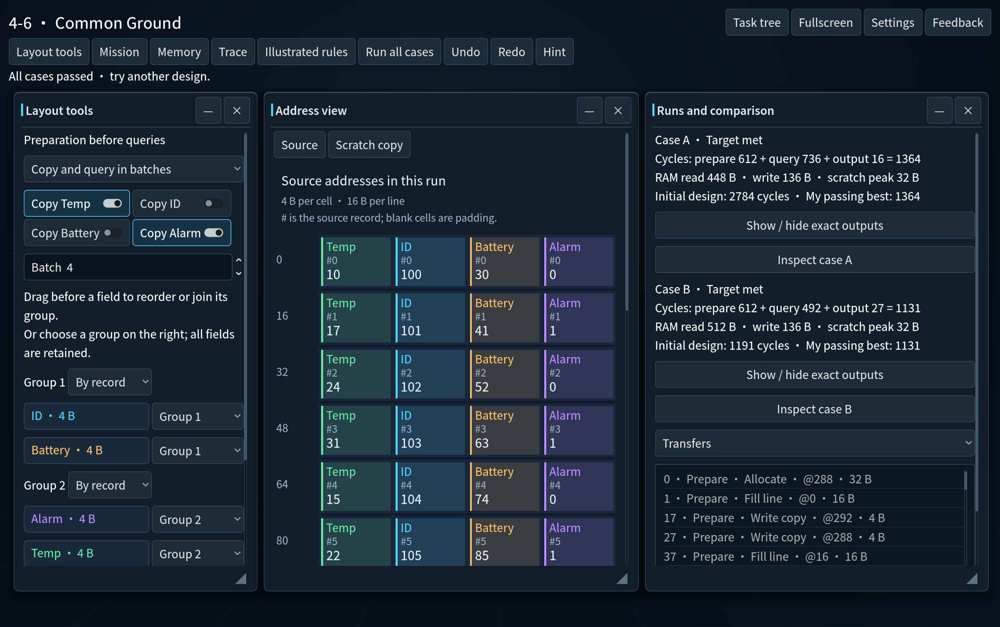
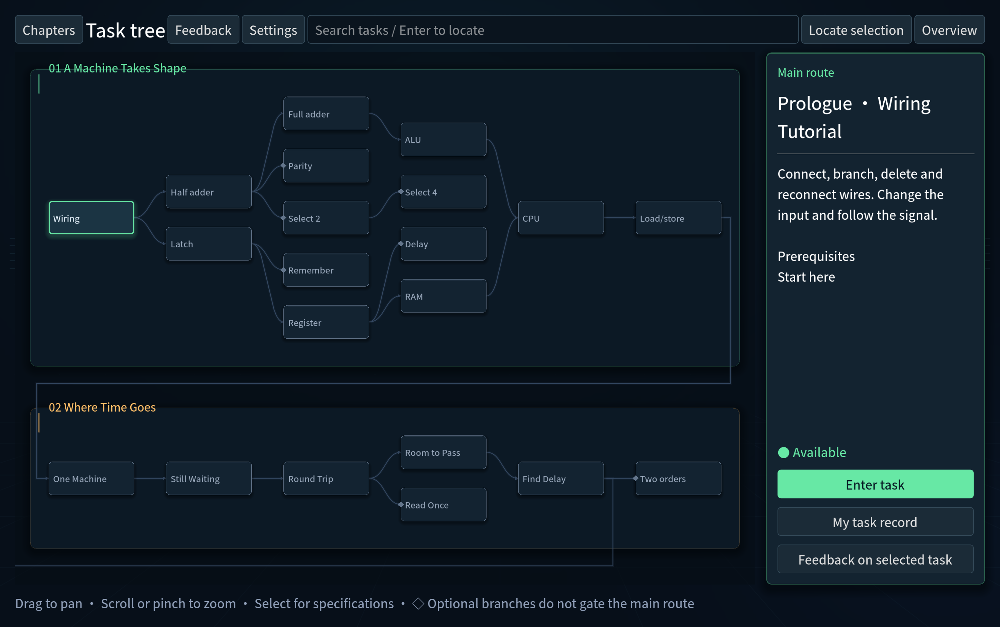
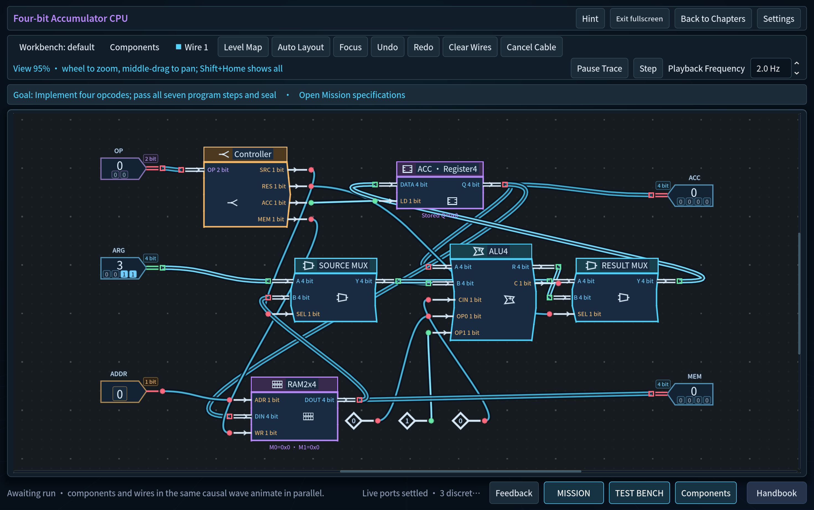
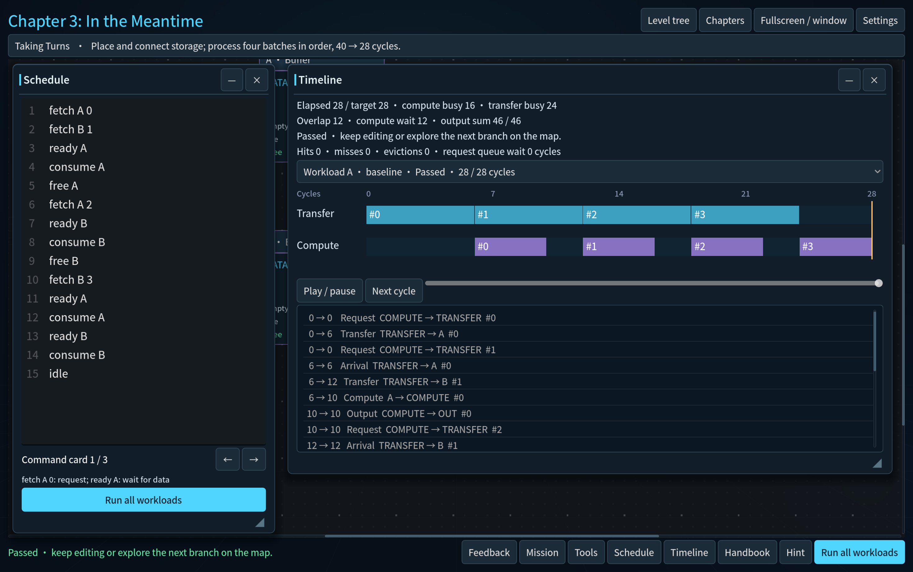
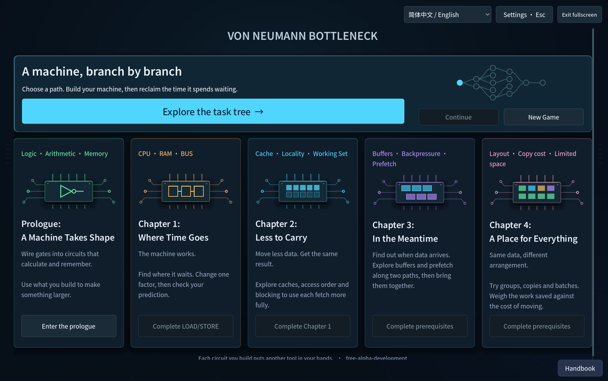

# Von Neumann Bottleneck

[简体中文](README.md) · **English**

**Build a machine from a single wire. Then reclaim the time it spends waiting.**

A construction and optimization puzzle about computers and the data they move. Start with logic gates and registers, build a small computer, then explore caches, buffering, prefetching and memory layout. Wire it up, watch it run, compare the results and find your own solution.

**Five regions · 40 tasks · Offline single-player · Chinese and English**



*Common Ground, Chapter 4: the same data serves two workloads. Arrange it, batch it, and compare the real cost of moving it. [Capture provenance and metrics](docs/images/readme/layout-manifest.json).*

**Source update (2026-09-14):** goals and required cases come first, Handbook diagrams unfold one example at a time, and wire feedback follows the current interaction. Hub/tree images below are refreshed; the existing frozen candidate predates these fixes.

[What's changed](CHANGELOG.md#english) · [Current build and verification](docs/CURRENT_STATE.md) · [Getting started](#getting-started) · [Report an issue](https://github.com/wizardpc-com/von-neumann-bottleneck/issues)

## What you do

- **Build your own machine.** Choose parts, place and wire them freely, branch from an existing wire, delete, undo and save named designs.
- **Follow the branches.** Arithmetic and memory lead toward a CPU; optional applications give familiar tools new uses. Optional branches do not add gates to the original main route. Continue locates your most recently visited task.
- **Account for the waiting.** Try individual inputs, run the complete tests, then inspect computation, transfers and waiting in the playback, timeline and profiler.
- **Do the same work with less delay.** Change access order, reuse, scheduling or layout. A correct solution can be the starting point for a more efficient one.
- **Learn when you need to.** Reopen the task specification at any time and explore a gradually unlocked illustrated handbook. Hints use a separate read-only canvas, with individual confirmation for the deeper two stages.



*All screenshots come from the game. The hub and task tree use an isolated fresh profile; the level showcases use designs from a separate QA save. [Image provenance and verification scope](docs/images/readme/README.md)*

## Two different kinds of puzzle

### Make the parts work together

The prologue's **Four-bit Accumulator CPU** brings the arithmetic and memory branches together. Wire the modules you built into a small machine that loads, adds, stores and retrieves values. The internal wiring is yours to design; the values after each instruction reveal whether the whole machine works.



### Put the waiting time to work

In Chapter 3's **Taking Turns**, the next batch can arrive while the current one is being processed. Place buffers, connect their data and status signals, then coordinate the work. Extra parts alone won't do it: filling, using and releasing each buffer must happen at the right time. The timeline shows where you have removed waiting.



## Five regions, a growing machine



| Region | What you explore |
| --- | --- |
| Prologue · **A Machine Takes Shape** | Build arithmetic and memory from gates, then bring your own components together in a CPU. |
| Chapter 1 · **Where Time Goes** | Connect CPU, Bus and RAM; separate computation from waiting and test your diagnosis. |
| Chapter 2 · **Less to Carry** | Explore caches, locality, working sets and blocking to get more use from each fetch. |
| Chapter 3 · **In the Meantime** | Coordinate buffering, backpressure and prefetching so transfers and computation can overlap. |
| Chapter 4 · **A Place for Everything** | Arrange fields, groups and batches while accounting for real copy costs, traffic and limited scratch space. |

The game uses deterministic, deliberately simplified models. Ordinary wires add no latency; waiting and bandwidth belong to modeled components such as Bus, RAM and Cache. Playback speed never changes the result.

See the [maintenance guide](docs/development/final-maintenance.md) for extending tasks, replacing artwork and configuring a feedback receiver.

## Getting started

[Your first session](docs/distribution/astra-challenge/quickstart.en.md) · [Launch preparation](docs/distribution/astra-challenge/README.md)

### Run from source

Install **Godot 4.7.1 stable**, make its executable available as `godot` on your `PATH`, then run:

```sh
git clone https://github.com/wizardpc-com/von-neumann-bottleneck.git
cd von-neumann-bottleneck
godot --editor --path . --import
godot --path .
```

Alternatively, import `project.godot` in the Godot editor, wait for resource import and use **Run Project / F5**. Choose **Explore the task tree** and begin with Wiring Tutorial.

The default interface language is Simplified Chinese. Select English using the bilingual language menu at the **top of the home screen**, or in **Settings → Language**; your choice is saved. You can also choose it at launch:

```sh
godot --path . -- --locale=en
```

### Candidate builds and platforms

This is a **free Alpha candidate in development; the latest candidate has not been publicly released**. Older packages on the repository's Releases page do not represent the current five-region game. [CURRENT_STATE](docs/CURRENT_STATE.md) identifies the frozen build, package hashes and verification scope.

If you receive a candidate ZIP, extract it and open the `.app` on Mac or the `.exe` on Windows. Godot is not required to play an exported build. Mac is the primary development and native-playtest platform. Windows has an exported candidate but still needs real-machine validation. Another Mac installation/notarization, external beginners and extended DPI/focus sessions remain pending too.

To build Mac and Windows candidates from one commit, follow the [candidate build guide](docs/distribution/free-alpha.md). Each frozen commit receives its own build identity.

### Useful controls

| Action | How |
| --- | --- |
| Find a task | Pan, zoom or search the task tree; select a node to read its specification. |
| Place a component | Drag it from the open component tray, or click to place repeated copies. |
| Cancel an operation | Right-click or Esc. |
| Undo / redo | Mac: ⌘Z / ⇧⌘Z. Windows: Ctrl+Z / Ctrl+Y. Text fields handle text edits first. |
| Toggle fullscreen | F11 / Alt+Enter, or the onscreen fullscreen button. |
| Leave task feedback | F8 or Feedback; unfinished tasks can also receive ratings and comments. |

Mac also supports **⌘,** for Settings and **⌃⌘F** for fullscreen. Drag a tool, Settings or Handbook by its title. Window positions are kept inside the available view.

## Saves, settings and feedback

Progress and named designs stay on your computer. Back up the entire save directory before updating or reverting; do not erase player data to prepare a test. See the [package instructions](distribution/PLAYTEST-README.txt) for locations and compatibility notes.

Settings include language, sound volume, display controls, reduced motion and local diagnostics. Feedback stays local by default, and the current candidate has no remote receiver configured. Statistics, written feedback and experimental scores have separate sharing controls. Declining uploads does not restrict the game. Your personal task board works offline and shows total and regional completion.

To report a bug, open a [GitHub Issue](https://github.com/wizardpc-com/von-neumann-bottleneck/issues) with the build ID, operating system, task and steps to reproduce it. Exporting feedback in the game does not automatically post it to GitHub; you decide whether to share the file.

## Development and documentation

- [Current state](docs/CURRENT_STATE.md) · [Release acceptance gates](RELEASE_BLOCKERS.md)
- [Bilingual changelog](CHANGELOG.md) · [Documentation index](docs/README.md)
- [Architecture](ARCHITECTURE.md) · [Simulation models](docs/architecture/simulation.md) · [Content and save contracts](docs/architecture/content-system.md)
- [Mac handoff](docs/development/mac-handoff.md) · [Isolated verification](docs/development/testing.md) · [Candidate builds](docs/distribution/free-alpha.md)
- [Feedback and privacy](docs/architecture/community-feedback.md) · [Future deployment checklist](docs/distribution/community-deployment-checklist.md)

Code is available under the [MIT License](LICENSE). The bundled font is [Noto Sans SC / SIL OFL 1.1](assets/fonts/OFL-NotoSansSC.txt). Interface graphics are drawn by project code.
