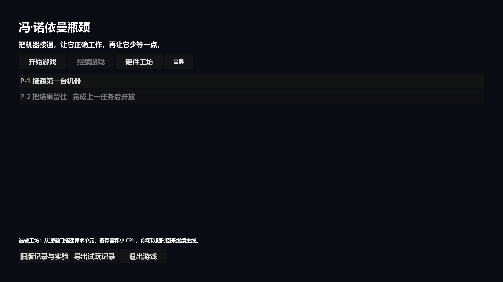
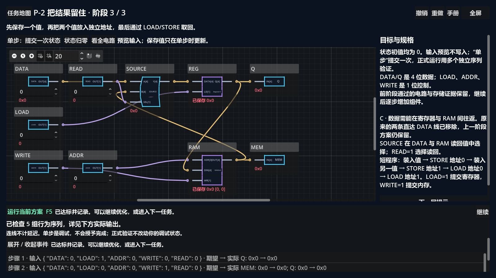
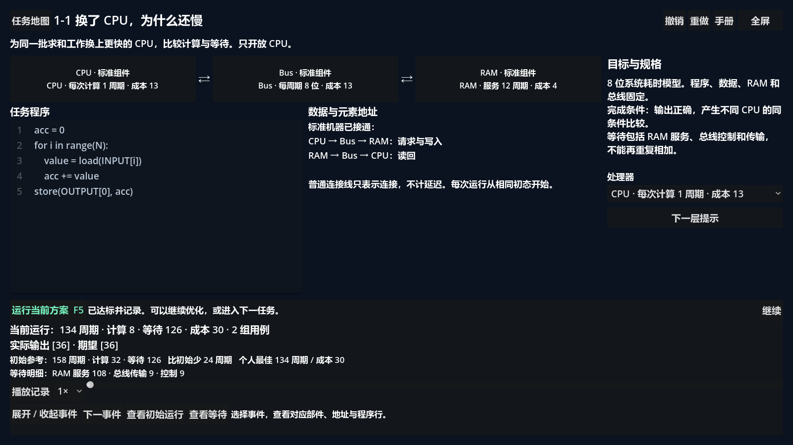
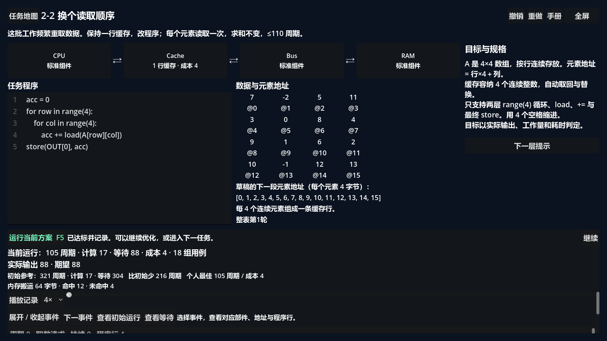

# Von Neumann Bottleneck

> Connect a machine, make it work, then reduce the time it spends waiting for data.

**Project status:** early prototype / playable demo. This repository is not a complete game, a production-ready release, or a promise that the current progression and presentation are final.

Von Neumann Bottleneck is a construction and optimization puzzle about computer data flow. Connect a working machine, run the task, then change where data goes and when it is reused to reduce waiting. The new eight-task mainline uses standard modules; deep gate construction is an optional workshop.

## Core idea

- **Construct:** connect standard modules in the mainline; optionally build arithmetic and storage from gates in the workshop.
- **Observe:** follow authoritative simulation events through the components and routes shown on screen.
- **Optimize:** compare computation, waiting and data movement, then improve the program or the parts within the task's limits.

The models are deliberately bounded teaching models. They make costs and causal flow visible without claiming physical or cycle-accurate hardware realism.

## Playable Demo

**Start game** follows eight tasks: source selection → staged storage → CPU comparison → RAM/Bus upgrades → cache reuse → access order → grouping → final optimization. **Continue game** restores the task, stage and draft. Hardware workshop and legacy records are secondary entries; they retain existing player-built designs and independent saves.

The [redesign status](docs/status/demo-redesign.md) records behavior, calibrated results, save boundaries, fresh verification and the remaining UI/human acceptance items. This is a playable implementation of all eight tasks, not a claim that every blueprint polish criterion or human playtest has passed.

## Screenshots

<table>
  <tr>
    <td width="50%" valign="top">
      
      <br><sub>Mainline menu — Start, Continue and optional workshop.</sub>
    </td>
    <td width="50%" valign="top">
      
      <br><sub>Mainline circuit — visible player wiring and state.</sub>
    </td>
  </tr>
  <tr>
    <td width="50%" valign="top">
      
      <br><sub>CPU comparison — computation and waiting remain distinct.</sub>
    </td>
    <td width="50%" valign="top">
      
      <br><sub>Cache optimization — program, addresses and results together.</sub>
    </td>
  </tr>
</table>

## Quick Start

Install **Godot 4.7.1 stable** and make its executable available as `godot` on `PATH`, then:

```powershell
git clone https://github.com/wizardpc-com/von-neumann-bottleneck.git
cd von-neumann-bottleneck
godot --path .
```

If your Godot executable uses another name, substitute that command. You can also import `project.godot` in the Godot editor and run the project there.

The interface defaults to Simplified Chinese. Start with the English catalog using:

```powershell
godot --path . -- --locale=en
```

An ordinary launch enters Game mode. Mainline progress lives in `demo_progress_v1.json`, with recoverable writes and behavior replay of accepted designs. It is separate from the legacy `savegame_v1.json` index and named workshop files. Opening Start again does not delete progress. Unknown/future save formats are protected from overwrite.

`--test-mode` remains development-only and uses isolated temporary progress. Use an isolated user-data directory for clean ordinary Game playtests; do not use the legacy destructive reset command to prepare a mainline playtest.

## Windows friend build

Install Godot 4.7.1 export templates once, then create the self-contained Windows EXE and ZIP with:

```powershell
powershell -ExecutionPolicy Bypass -File .\scripts\build-playtest.ps1 -GodotExecutable 'C:\path\to\Godot_v4.7.1-stable_win64.exe'
```

The script writes `build/playtest/Von-Neumann-Bottleneck.exe` and `build/Von-Neumann-Bottleneck-Windows-Playtest.zip`. Friends only need to extract the ZIP and double-click the EXE; Godot and the repository are not required on their machine. See [`distribution/PLAYTEST-README.txt`](distribution/PLAYTEST-README.txt).

## Current Status

- Engine: Godot 4.7.1 stable with strongly typed GDScript.
- Runtime presentation: built-in Godot UI, graph controls, and procedural drawing; no external addons or asset pipeline.
- Simulation: deterministic, UI-independent results and traces; animation timing does not affect outcomes.
- Content: eight implemented mainline tasks, optional hardware workshop and retained legacy labs; human playtest acceptance remains open.
- Localization: Simplified Chinese by default, with an English catalog as the first alternate locale.
- Verification: addon-free local simulation and UI suites are documented, but the repository does not yet have a GitHub Actions workflow.

See the slice status documents for implemented behavior, reference results, known limitations, and current playtest questions.

## Documentation

- [Documentation map](docs/README.md)
- [Architecture overview](ARCHITECTURE.md)
- [Simulation architecture and model limits](docs/architecture/simulation.md)
- [Content and player-state contract](docs/architecture/content-system.md)
- [Localization boundary](docs/architecture/localization.md)
- [Design principles](docs/design/core-principles.md)
- [Testing commands and verified outcomes](docs/development/testing.md)
- [Architecture decisions](docs/decisions/README.md)
- [Execution-plan policy](PLANS.md)

Historical milestones and completed execution plans remain under `docs/status/` and `docs/exec-plans/completed/` as implementation evidence.

## License

Released under the [MIT License](LICENSE). Copyright (c) 2026 wizardpc-com.
