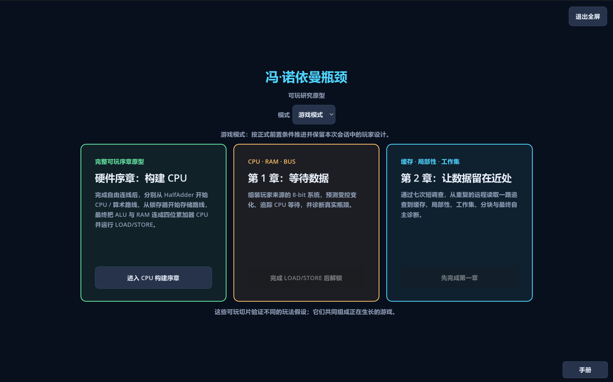
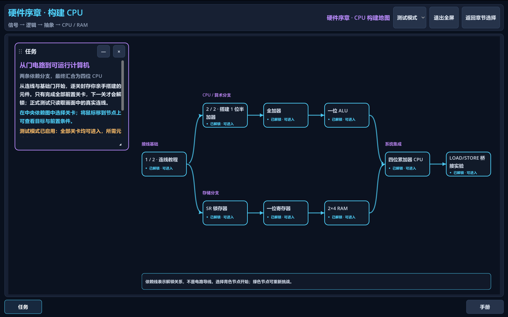
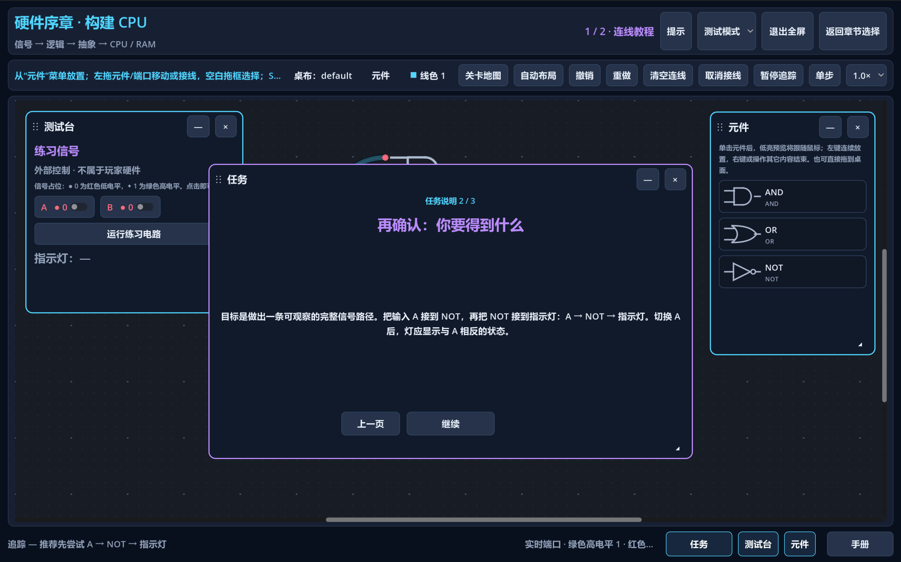
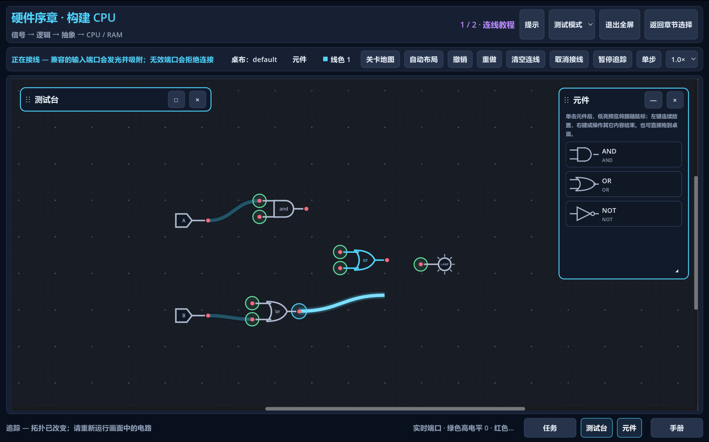

# Von Neumann Bottleneck

> A systems puzzle prototype about building computing abstractions and tracing where time and data movement go.

**Project status:** early prototype / playable demo. This repository is not a complete game, a production-ready release, or a promise that the current progression and presentation are final.

Von Neumann Bottleneck moves from direct signal wiring to CPU, RAM, Bus, and Cache behavior. The player builds or configures a machine, predicts what will change, runs a deterministic simulation, and uses Trace and Profiler evidence to explain the result.

## Core idea

- **Construct:** build logic from gates into reusable arithmetic and storage components, then connect those abstractions into small computers.
- **Observe:** follow authoritative simulation events through the components and routes shown on screen.
- **Explain:** compare controlled runs and diagnose when computation, waiting, transfer, or data locality dominates the result.

The models are deliberately bounded teaching models. They make costs and causal flow visible without claiming physical or cycle-accurate hardware realism.

## Playable slices

The startup hub currently connects three playable slices:

1. **[CPU Building Prologue](docs/status/cpu-building-prologue.md)** — learn direct wiring, build arithmetic and storage branches, join them in a four-bit accumulator computer, and run a visible LOAD/STORE program.
2. **[Chapter 1 — Waiting for Data](docs/status/chapter-1-waiting-for-data.md)** — assemble an 8-bit CPU–Bus–RAM system and work through five prediction, controlled-comparison, Trace, Profiler, and bottleneck-diagnosis investigations.
3. **[Chapter 2 — Reducing Data Movement](docs/status/chapter-2-reducing-data-movement.md)** — work through seven investigations covering Cache, Locality, Working Set, Blocking/Tiling, and a diagnosis-first capstone with more than one valid solution.

These slices test successive gameplay hypotheses; together they are still only a growing playable prototype.

## Screenshots

<table>
  <tr>
    <td width="50%" valign="top">
      
      <br><sub>Chapter selection — the three connected playable slices.</sub>
    </td>
    <td width="50%" valign="top">
      
      <br><sub>Hardware campaign map — arithmetic and storage branches merge into a CPU.</sub>
    </td>
  </tr>
  <tr>
    <td width="50%" valign="top">
      
      <br><sub>Mission briefing — concise staged guidance with direct links to the Handbook.</sub>
    </td>
    <td width="50%" valign="top">
      
      <br><sub>Circuit workbench — direct component placement and visible wiring.</sub>
    </td>
  </tr>
</table>

## Quick Start

Install **Godot 4.7.1 stable** and make its executable available as `godot` on `PATH`, then:

```powershell
git clone https://github.com/wizardpc-com/von-neumann-bottleneck.git
cd von-neumann-bottleneck
godot --path .
```

If your Godot executable uses another name, substitute that command. You can also import `project.godot` in the Godot editor and run the project there.

The interface defaults to Simplified Chinese. Start with the English catalog using:

```powershell
godot --path . -- --locale=en
```

An ordinary launch always enters Game mode and hides development-only mode controls. Chapter selection offers **Continue** after the first completed task and a confirmed **New Game** action. Game progression and verified reusable-component provenance persist locally in `savegame_v1.json`; named circuit topology remains in the independent workbench file. If a required workbench topology is missing or its signature no longer matches, only that design and its dependents require replay.

For isolated development access to every current level, launch with `godot --path . -- --test-mode`; the selector is then available for QA. Test progression stays temporary and is never copied into the Game save.

For a clean developer playtest that removes Game progression, local anonymous session streams, and Hardware workbenches while preserving prior exported JSON files:

```powershell
godot --path . -- --test-mode --reset-local-test-state
```

## Windows friend build

Install Godot 4.7.1 export templates once, then create the self-contained Windows EXE and ZIP with:

```powershell
powershell -ExecutionPolicy Bypass -File .\scripts\build-playtest.ps1 -GodotExecutable 'C:\path\to\Godot_v4.7.1-stable_win64.exe'
```

The script writes `build/playtest/Von-Neumann-Bottleneck.exe` and `build/Von-Neumann-Bottleneck-Windows-Playtest.zip`. Friends only need to extract the ZIP and double-click the EXE; Godot and the repository are not required on their machine. See [`distribution/PLAYTEST-README.txt`](distribution/PLAYTEST-README.txt).

## Current Status

- Engine: Godot 4.7.1 stable with strongly typed GDScript.
- Runtime presentation: built-in Godot UI, graph controls, and procedural drawing; no external addons or asset pipeline.
- Simulation: deterministic, UI-independent results and traces; animation timing does not affect outcomes.
- Content: three connected playable slices, but no complete campaign or stable release contract.
- Localization: Simplified Chinese by default, with an English catalog as the first alternate locale.
- Verification: addon-free local simulation and UI suites are documented, but the repository does not yet have a GitHub Actions workflow.

See the slice status documents for implemented behavior, reference results, known limitations, and current playtest questions.

## Documentation

- [Documentation map](docs/README.md)
- [Architecture overview](ARCHITECTURE.md)
- [Simulation architecture and model limits](docs/architecture/simulation.md)
- [Content and player-state contract](docs/architecture/content-system.md)
- [Localization boundary](docs/architecture/localization.md)
- [Design principles](docs/design/core-principles.md)
- [Testing commands and verified outcomes](docs/development/testing.md)
- [Architecture decisions](docs/decisions/README.md)
- [Execution-plan policy](PLANS.md)

Historical milestones and completed execution plans remain under `docs/status/` and `docs/exec-plans/completed/` as implementation evidence.

## License

Released under the [MIT License](LICENSE). Copyright (c) 2026 wizardpc-com.
