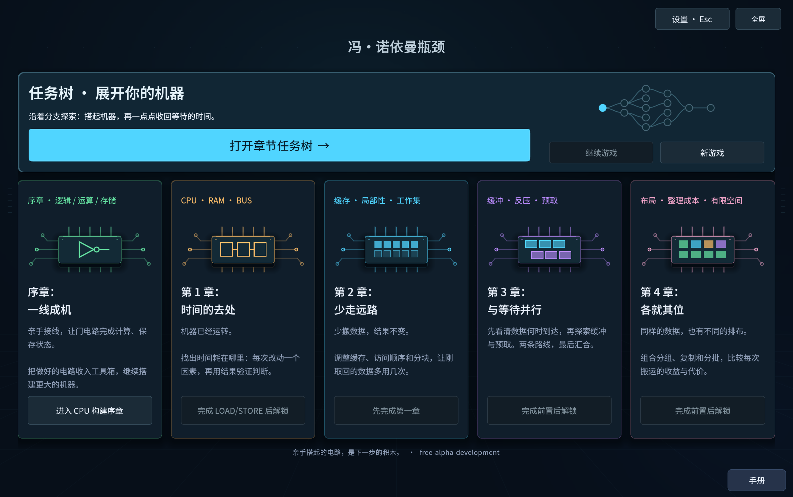
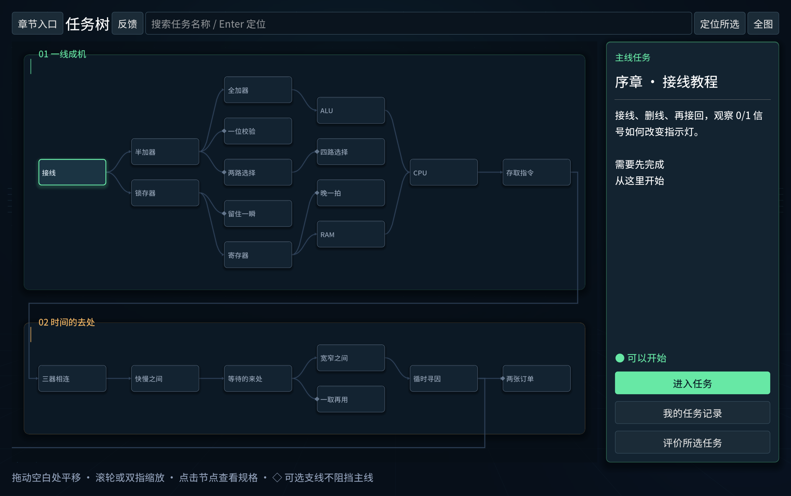

# 冯·诺依曼瓶颈

**简体中文** · [English](README.en.md)

**从一根线搭起机器，再找回它等待数据的时间。**

一款关于计算机与数据流的构建解谜游戏。从逻辑门、寄存器到自己的小计算机，再探索缓存、缓冲、预取与数据布局。接出电路，观察运行，比较结果，寻找自己的解法。

**五个区域 · 40 个任务 · 离线单机 · 中英文界面**



[更新说明](CHANGELOG.md#简体中文) · [当前版本与验证记录](docs/CURRENT_STATE.md) · [运行方法](#开始游玩) · [问题反馈](https://github.com/wizardpc-com/von-neumann-bottleneck/issues)

## 在这里做什么

- **搭建自己的机器。** 从元件台选件，自由放置、接线、在线段中间分支；可以删除、撤销，并保存命名方案。
- **沿着任务树探索。** 算术与存储分支汇入 CPU，应用支线提供新的用途。可选支线不增加原主线门槛，“继续游戏”会定位最近游玩的任务。
- **看清每一次等待。** 调试输入、运行完整测试，再用回放、时间线和分析器查看计算、搬运与等待。
- **让相同的工作少花时间。** 改变访问顺序、复用方式、调度或布局；结果正确还不够，也可以继续寻找更省搬运的方案。
- **按需学习。** 任务规格随时可看，图解手册逐步开放；Hint 在独立只读画布中逐层揭示，后两级分别确认。



*配图为当前源码的实际界面渲染，使用隔离新档；未添加示意 UI 或伪造通关状态。[配图来源](docs/images/readme/README.md)*

## 五个区域，一条逐渐展开的路线

| 区域 | 你会探索什么 |
| --- | --- |
| 序章 · **一线成机** | 从逻辑门构建运算和存储，将自己的成果组合成 CPU。 |
| 第一章 · **时间的去处** | 连接 CPU、Bus 与 RAM，分辨计算与等待，验证瓶颈判断。 |
| 第二章 · **少走远路** | 研究缓存、局部性、工作集和分块，让取回的数据多用几次。 |
| 第三章 · **与等待并行** | 安排缓冲、反压与预取，让数据搬运和计算配合起来。 |
| 第四章 · **各就其位** | 组合字段、排列和分批，权衡真实复制成本、流量与有限空间。 |

关卡采用确定性的简化模型。普通连线只表示连接，没有额外延迟；等待与带宽来自 Bus、RAM、Cache 等被建模的部件。动画快慢不改变计算结果。

## 开始游玩

### 从源码运行

安装 **Godot 4.7.1 stable**，将可执行文件加入 `PATH`，然后运行：

```sh
git clone https://github.com/wizardpc-com/von-neumann-bottleneck.git
cd von-neumann-bottleneck
godot --editor --path . --import
godot --path .
```

也可以在 Godot 中导入 `project.godot`，完成资源导入后按 **“运行项目”／F5** 启动整个游戏。首页选择 **打开章节任务树**，从接线教程开始。

游戏默认简体中文，可在 **设置 → 语言** 中切换 English；选择会保存。也可指定启动语言：

```sh
godot --path . -- --locale=en
```

### 候选包与平台

目前是**免费 Alpha 候选阶段，最新候选尚未公开发行**。仓库中旧 Release 的试玩包不代表当前五区域版本。准确构建编号、包哈希及验收范围以 [CURRENT_STATE](docs/CURRENT_STATE.md) 为准。

收到候选包后，Mac 解压打开 `.app`，Windows 解压运行 `.exe`，无需另外安装 Godot。Mac 是主要开发与原生试玩环境；Windows 包已导出，仍需实机验收。另一台 Mac 安装／公证、外部新手和长时间 DPI／焦点测试也尚未完成。

自行生成同一提交的 Mac／Windows 候选包，请使用[统一构建流程](docs/distribution/free-alpha.md)，不要把不同提交的包混用同一个版本号。

### 常用操作

| 操作 | 方法 |
| --- | --- |
| 查找下一关 | 在任务树拖动、缩放、搜索；选择节点查看任务规格。 |
| 放置元件 | 从默认打开的元件台拖到画布，或点击后连续放置。 |
| 取消当前操作 | 右键或 Esc。 |
| 撤销／重做 | Mac：⌘Z／⇧⌘Z；Windows：Ctrl+Z／Ctrl+Y。文本框优先处理文字编辑。 |
| 切换全屏 | F11／Alt+Enter，或界面上的全屏按钮。 |
| 评价当前任务 | F8 或“反馈”；未通关也可以评分、写意见。 |

## 进度、设置与反馈

进度和命名方案保存在本机。更新或回退版本前，请完整备份存档目录；不要通过清档准备试玩。具体位置和兼容性见[随包说明](distribution/PLAYTEST-README.txt)。

设置包含语言、音效音量、显示、减少动效和本地诊断。反馈默认留在本机；当前候选未配置远程服务器。自动统计分享、主动意见和实验成绩分别授权，拒绝上传不影响完整游玩。个人任务板可以离线查看总完成数和各区域进度。

发现问题可提交 [GitHub Issue](https://github.com/wizardpc-com/von-neumann-bottleneck/issues)，附上构建编号、系统、任务和复现步骤。游戏内导出不会自动发布到 GitHub，是否分享文件由你决定。

## 开发与文档

- [当前状态](docs/CURRENT_STATE.md) · [发布前待验收项](RELEASE_BLOCKERS.md)
- [中英文更新说明](CHANGELOG.md) · [文档导航](docs/README.md)
- [架构](ARCHITECTURE.md) · [仿真模型](docs/architecture/simulation.md) · [内容与存档约定](docs/architecture/content-system.md)
- [Mac 开发交接](docs/development/mac-handoff.md) · [隔离测试](docs/development/testing.md) · [候选包构建](docs/distribution/free-alpha.md)
- [反馈与隐私设计](docs/architecture/community-feedback.md) · [后续部署清单](docs/distribution/community-deployment-checklist.md)

代码采用 [MIT License](LICENSE)。字体采用 [Noto Sans SC / SIL OFL 1.1](assets/fonts/OFL-NotoSansSC.txt)；界面图形由本项目代码绘制。
