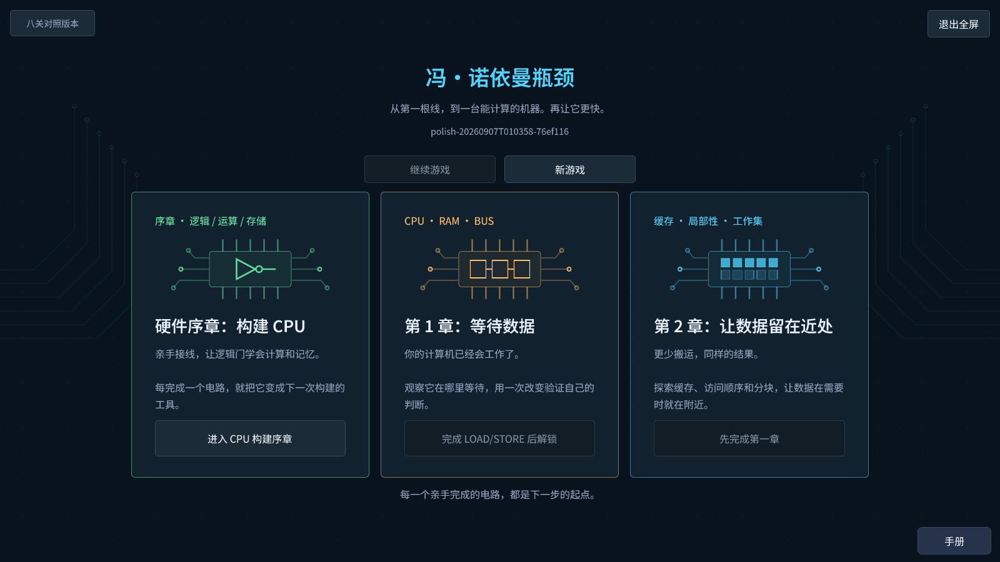
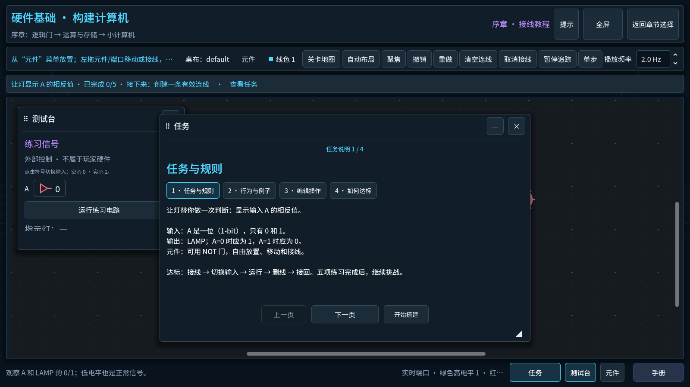
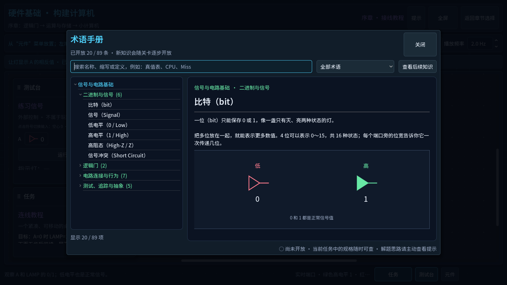
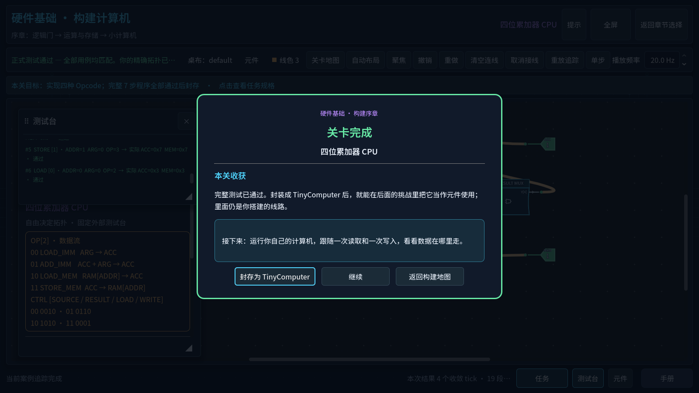

# Von Neumann Bottleneck

2026-09-10 开发中：总任务树连接四个区域，新增五条可选支线（共 34 个节点）及三个附加挑战；旧主线门槛不变。详见[实施与验收计划](docs/exec-plans/active/task-tree-and-side-missions.md)。自动检查已覆盖新增内容，本地反馈记录与多会话报告已升级；完整原生试玩仍在进行。

> Connect a machine, make it work, then reduce the time it spends waiting for data.

**Project status:** early prototype / playable demo. This repository is not a complete game, a production-ready release, or a promise that the current progression and presentation are final.

Von Neumann Bottleneck is a construction and optimization puzzle about computer data flow. Connect a working machine, run the task, then change where data goes and when it is reused to reduce waiting. The default route builds arithmetic and storage circuits into a computer, then investigates and reduces data movement.

## Core idea

- **Construct:** build arithmetic and storage from gates, seal working components, then connect them into a CPU.
- **Observe:** follow authoritative simulation events through the components and routes shown on screen.
- **Optimize:** compare computation, waiting and data movement, then improve the program or the parts within the task's limits.

The models are deliberately bounded teaching models. They make costs and causal flow visible without claiming physical or cycle-accurate hardware realism.

## Playable Demo

Open **Hardware Foundations** from the default chapter hub. The original route is Tutorial → arithmetic/storage branches → CPU → LOAD/STORE → Chapter 1 → Chapter 2. Named designs, free editing, floating Mission and independent progressive hints are available in ordinary Game. The eight-task runtime was removed on 2026-09-09; historical code remains in Git.

The [guided workbench update](docs/verification/2026-09-09-guided-workbench/README.md) records open component tools, clearer cable separation and the 96-term illustrated Handbook with focused lesson recommendations. The [visual and learning status](docs/status/visual-learning-polish.md), [construction experience](docs/status/construction-experience.md) and [recovery record](docs/status/in-place-recovery.md) preserve earlier work and package evidence. Native checks are scoped in their records; novice and release acceptance remain open.

## Screenshots

<table>
  <tr>
    <td width="50%" valign="top">
      
      <br><sub>Original chapter hub — construction, systems and data movement.</sub>
    </td>
    <td width="50%" valign="top">
      
      <br><sub>Mission — explicit goals, specification sections and Start Building.</sub>
    </td>
  </tr>
  <tr>
    <td width="50%" valign="top">
      
      <br><sub>Handbook — current concepts and diagrams, gradually opened by play.</sub>
    </td>
    <td width="50%" valign="top">
      
      <br><sub>Completion — your constructed component and the next capability.</sub>
    </td>
  </tr>
</table>

## Quick Start

**Development handoff:** Mac is the primary development/playtest machine; Windows verifies compatibility and exported builds. Start with the [Mac handoff guide](docs/development/mac-handoff.md) for the current baseline, isolated verification and remaining acceptance tasks.

Install **Godot 4.7.1 stable** and make its executable available as `godot` on `PATH`, then:

```powershell
git clone https://github.com/wizardpc-com/von-neumann-bottleneck.git
cd von-neumann-bottleneck
godot --path .
```

If your Godot executable uses another name, substitute that command. You can also import `project.godot` in the Godot editor and run the project there.

The interface defaults to Simplified Chinese. Start with the English catalog using:

```powershell
godot --path . -- --locale=en
```

An ordinary launch enters Game mode. The original `savegame_v1.json` recovery index and `hardware_workbenches_v1.json` named designs retain their provenance checks. Historical `demo_progress_v1.json` files remain preserved but have no runtime entry and cannot unlock original construction.

`--test-mode` is development-only. Use isolated APPDATA/LOCALAPPDATA for clean playtests; do not clear player files to prepare a test.

## Windows friend build

Current Mac source and native-play evidence: [Mac workbench polish](docs/status/mac-native-polish.md). The restart-provenance issue is repaired with verified legacy recovery; see the [native restart evidence](docs/verification/2026-09-08-save-recovery/README.md).

Historical package: [Windows visual/learning playtest candidate](https://github.com/wizardpc-com/von-neumann-bottleneck/releases/tag/playtest-polish-20260907T010358). Build `polish-20260907T010358-76ef116` uses the original chapter hub. See [verification and limits](docs/status/visual-learning-polish.md), including the distinction between rendered Game replay and native desktop acceptance.

Install Godot 4.7.1 export templates once, then export into a new output directory:

```powershell
$buildDirectory = 'build/windows-' + (Get-Date -Format 'yyyyMMddTHHmmss')
New-Item -ItemType Directory -Path $buildDirectory | Out-Null
godot_console --headless --path . --export-release 'Windows Playtest' "$buildDirectory/Von-Neumann-Bottleneck.exe"
if ($LASTEXITCODE -ne 0) { throw 'Godot export failed' }
Copy-Item distribution/PLAYTEST-README.txt, assets/fonts/OFL-NotoSansSC.txt -Destination $buildDirectory
Compress-Archive -Path "$buildDirectory/*" -DestinationPath "$buildDirectory.zip"
```

Use a current build identifier and matching README before distribution; keep the source commit and package hashes. Friends only need to extract the ZIP and double-click the EXE; Godot and the repository are not required on their machine. See [`distribution/PLAYTEST-README.txt`](distribution/PLAYTEST-README.txt). The historical PowerShell helper replaces its fixed output folder; use unique outputs to retain verification baselines.

## Current Status

- Engine: Godot 4.7.1 stable with strongly typed GDScript.
- Runtime presentation: built-in Godot UI, graph controls, and procedural drawing; no external addons or asset pipeline.
- Simulation: deterministic, UI-independent results and traces; animation timing does not affect outcomes.
- Content: original construction prologue and two optimization chapters; the eight-task comparison has been removed. Shared schematic/editing improvements, structured construction specifications and 21 next-capability previews are implemented; physical mouse feel and novice acceptance remain open.
- Localization: Simplified Chinese by default, with an English catalog as the first alternate locale.
- Verification: addon-free local simulation and UI suites are documented, but the repository does not yet have a GitHub Actions workflow.

See the slice status documents for implemented behavior, reference results, known limitations, and current playtest questions.

## Documentation

- [Documentation map](docs/README.md)
- [Architecture overview](ARCHITECTURE.md)
- [Simulation architecture and model limits](docs/architecture/simulation.md)
- [Content and player-state contract](docs/architecture/content-system.md)
- [Localization boundary](docs/architecture/localization.md)
- [Design principles](docs/design/core-principles.md)
- [Testing commands and verified outcomes](docs/development/testing.md)
- [Architecture decisions](docs/decisions/README.md)
- [Execution-plan policy](PLANS.md)

Historical milestones and completed execution plans remain under `docs/status/` and `docs/exec-plans/completed/` as implementation evidence.

## License

Released under the [MIT License](LICENSE). Copyright (c) 2026 wizardpc-com.

### September 9 expansion checkpoint

Two optional circuit applications branch from Half Adder and Register. A searchable,
categorized toolbox and new named blank schemes preserve existing player designs.
Chapter 3 adds six exploration nodes on asynchronous transfers, double buffering,
backpressure and prefetch after Chapter 2 capstone. The retired eight-task runtime
is removed. See the [active acceptance plan](docs/exec-plans/active/exploration-and-overlap-chapter.md)
and [new model](docs/architecture/overlap-chapter.md); native Chapter 3 acceptance
is still pending and this checkpoint is not a release declaration.
