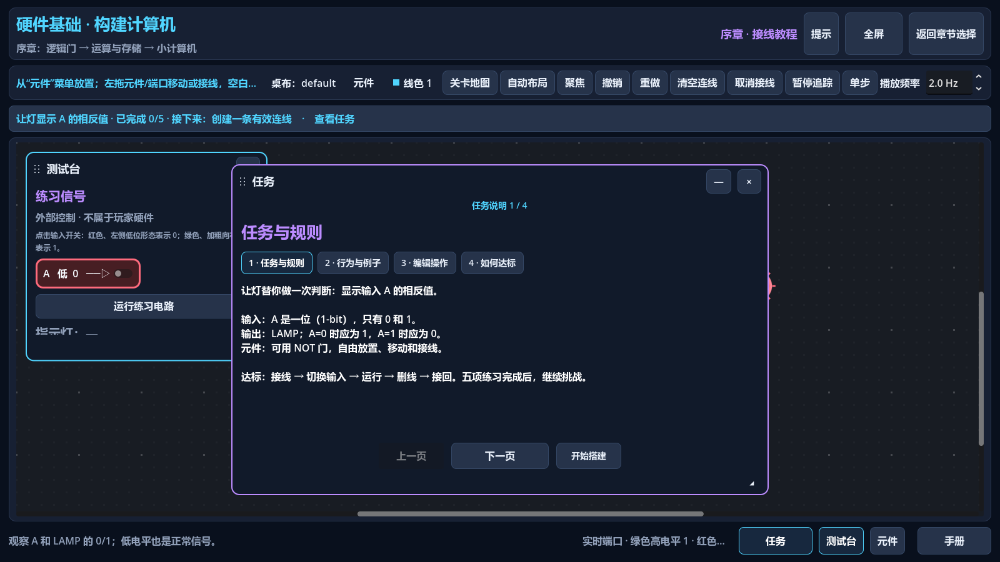
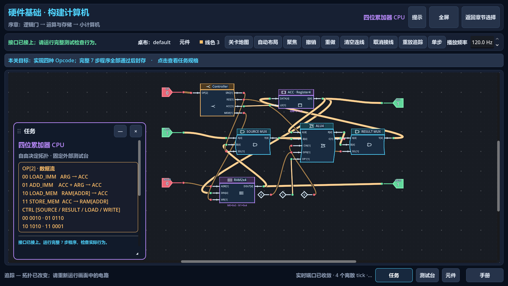
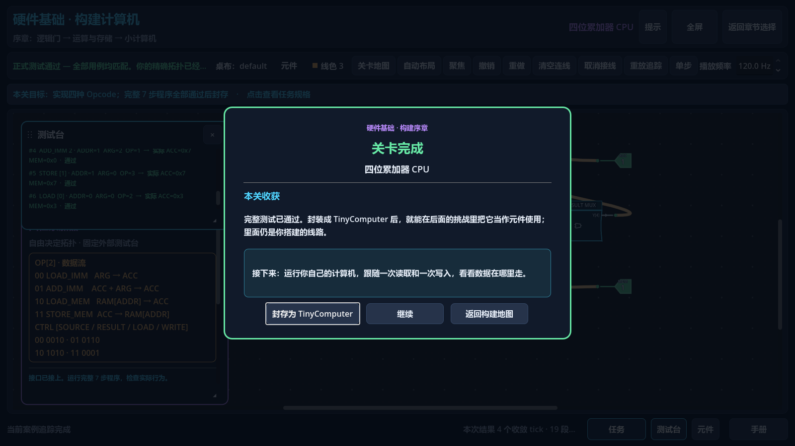

# Construction experience — 2026-09-06

The original construction game remains the default. This revision improves its schematic presentation, editing precision, task specifications and completion handoff. It preserves the arithmetic/storage → CPU → LOAD/STORE → Chapter 1 → Chapter 2 progression, both save families, named designs, voluntary hints and existing simulation rules. It does not replace the campaign or calibrate every level's difficulty.

## Player-visible changes

- **Circuits:** filled neutral gate silhouettes with uppercase names; separate module headings; larger port labels and direction arrows. One-bit cables use a 3.5 px stroke and buses 5.5 px. Player cable colors remain independent of red/green/gray port state. Zero is a normal value. Hover identifies an electrically connected network without crossing a component's logic boundary.
- **Navigation and editing:** `Home` or Focus frames selected components, or the whole circuit when nothing is selected; `Shift+Home` always frames all. Camera changes preserve topology and layout. Closely spaced ports resolve by pointer distance. A precise right click removes the nearest contacted wire; a continuous erase stroke still sweeps across content and forms one undo transaction.
- **Tasks and learning:** the floating Mission has direct specification sections and a visible Start Building action. Previous/Next, moving, resizing, compact mode and reopening remain available. Tutorial's persistent goal shows completed actions and the next practice step. Original construction introductions state the new concept, interfaces, behavior examples and unchanged pass conditions. Half Adder's four input-row buttons select a debug case without running official tests or changing topology.
- **Success and continuation:** all 21 original level identities have a next-capability preview. A passing circuit explicitly offers sealing by component name; the message does not claim an unsealed component has already been earned. Post-seal summaries retain the learning/reward explanation. Feedback remains available behind an optional collapsed button. No automatic level jump is added.

## Preservation and repair evidence

The earlier recovery defects and selective routing restoration remain documented in [in-place recovery](in-place-recovery.md). This revision found additional precision and presentation issues through rendered ordinary Game input:

| Observed friction / cause | Final behavior | Evidence |
| --- | --- | --- |
| Heavy equal-width cables compete with symbols; module names share space with ports | Scalar/bus distinction, separate headings, larger labels, exact draw/hit/flow geometry | Geometry and port-clearance suites; Tutorial, Half Adder and CPU captures |
| Native rectangular port grab areas overlap; child order can choose the wrong endpoint | Nearest visible port wins; native hotzone coordinates are converted through the current zoom | ALU/Mux and Register/Latch GUI connections, non-unit zoom and camera checks |
| A neighboring node's transparent rectangle can intercept a visible RAM output | The pointed port's node receives native GUI input first; body selection still uses the existing editor handler | CPU wires from RAM to MEM and SOURCE MUX at the original saved seed coordinates |
| Eraser contact includes multiple nearby cables | One click chooses the nearest cable; sweeps and atomic undo remain available | CPU wrong-source correction preserves every other wire; precision/sweep regressions |
| Added sections can push the Mission navigation below its initial visible area | Larger bounded initial Mission, readable body and directly accessible Start Building | First-entry visibility assertion; Chinese/English and 1280×720 captures |
| CPU success uses its pre-pass disabled button wording; summaries imply rewards before sealing | Named sealing action and a distinct verified-but-unsealed message | Actual complete-test → seal → map UI checks |

Selection, body drag, placement, branching from line middles/junctions/endpoints/existing inputs, single-wire deletion, right erase, marquee/Shift selection, copy/paste, undo/redo, wire colors, named schemes and camera controls remain available in ordinary Game. Crossings do not create junctions. Direction, width and electrical rules still govern legal connections; the CPU accepts an out-of-order but legal build and rejects a fully connected incorrect source in its unchanged seven-step behavioral test.

Hints start hidden and remain independent read-only boards. H1, H2 and H3 are requested separately; H2 and H3 each require confirmation, with an explicit full-answer warning for H3. Returning restores scheme name, topology, positions and colors; edit history and clipboard are cleared under [ADR 0015](../decisions/0015-versioned-workbench-snapshots-and-read-only-hints.md). Reference circuits are never injected into the player's board. Specifications, including opcodes and port semantics, are directly accessible without hints.

## Verification and package

Build: `experience-20260906T013002-76ef116`, Godot `4.7.1.stable.official.a13da4feb`.

- [Windows ZIP](../../build/Von-Neumann-Bottleneck-Experience-20260906T013002.zip), 43,049,098 bytes. Extract and run `Von-Neumann-Bottleneck.exe`; Godot installation is unnecessary. ZIP SHA-256: `CE0CDCC44FE6F7DFEE4E5E22818C637CAABCB34B22ACD9B7EC64D27CB7AA7459`.
- EXE SHA-256: `EDAEAF0777A2BC852690BDCC0FECAEB5064FEC9AA32EFCC1F62999CE7F4A1340`. The archive contains only EXE, bilingual playtest instructions and a build manifest. Its EXE and README were read back and matched; 188 runtime resource hashes match the final source.
- All 19 conventional suites passed on the final implementation. `final-acceptance/results.json` records exits, explicit PASS output and absence of script/parse failures. Simulation, save, localization, original chapters and the retained comparison are included.
- The twentieth suite, `test_recovery_game_input.gd`, passed **454 checks in each language**. Chinese final-behavior evidence: `native-port-layer.log` and `native-port-layer/zh_CN-ui-observations.json`; English: `final-acceptance/en.log` and `final-acceptance/en/en-ui-observations.json`. The final build label was separately rendered in a Chinese Tutorial interaction run, `version-capture.log`, with 121 passing checks.
- Source GUI input covers selection/drag, placement, wire middle/endpoint/network branching, precise erase and undo/redo, clipboard/multi-selection, named designs, all three hint levels and cancellation, exact hint return, valid/invalid CPU wiring, current/full tests, sealing, original unlocks, Mission sections, Focus, zoom/pan, text-focus return, window/fullscreen controls and 1280×720 goal/Mission bounds.
- Final EXE export, Game headless startup and Test headless startup exited 0. An earlier candidate (`003200`) was observed on the actual Windows desktop at the original hub with its build ID; a real OS click opened the original construction map. Windows then locked. **The final `013002` EXE has not received a full OS desktop mouse replay or final desktop screenshot.** No input was sent through the lock screen; this remains separate from the complete source GUI evidence.

Working evidence is under `.godot/experience/20260905T230741/`; failed iterations remain there for diagnosis and are not the acceptance result. Final logs contain the existing nonfatal Windows root-certificate-store warning; no script/parse/test error remains. Export prints the usual embedded-ICU compatibility notice with matching 4.7.1 templates. `git diff --check` passes.

The ordinary Game input script dispatches actual viewport GUI events from the configured main scene, builds both branches, seals the earned components, tests CPU/LOAD STORE, and opens Chapter 1 from the hub. It does not load a reference design, use the Test library, set progress or invoke controller actions. Source-driven GUI replay is separate from OS-level desktop interaction and from human playtesting.

## Compatibility and protection

The pre-existing 32 staged recovery paths remain staged exactly as supplied; this optimization is unstaged. HEAD is `76ef11610c3faf2b81722877fa91877a4589074d`. No commit, push, reset, clean or whole-tree restore was performed.

The binary staged patch matches the initial backup byte-for-byte (SHA-256 `5AF9F60DA53BBF4B8A0C3DEC3F6F698E5F78CFE8BD2E3F14435631D147A792AE`). The index file's metadata hash changed during inspection; no staged content changed. See `staged-final-verification.json` in the evidence root.

Backup `.godot/experience/20260905T230741/backup/` contains 331 hash-verified workspace files, staged/unstaged patches, HEAD/status/index hash, five actual player save/design files and the existing feedback export. Final player-file checks match their initial hashes. The Local player-data candidate remains absent. Every test and package launch uses isolated repository-local APPDATA/LOCALAPPDATA.

Save schema, source verification and default seed coordinates remain unchanged. Preserving coordinates also preserves the existing workbench seed fingerprints; visual changes do not reset the player's default design. The eight-task comparison retains independent progress and remains secondary.

## References and remaining playtest questions

[Turing Complete](https://turingcomplete.game/) and its [official Steam presentation](https://store.steampowered.com/app/1444480/Turing_Complete/) informed component identity, readable electrical interfaces and open-ended construction. [Human Resource Machine](https://tomorrowcorporation.com/humanresourcemachine) informed concrete jobs and gradual introduction of commands; [TIS-100](https://www.zachtronics.com/tis-100/) informed accessible machine specifications alongside open-ended problem solving. These are design inferences. No commercial source, graphics or exact puzzle solutions were imported.

Human gates remain: physical mouse comfort, High DPI and mixed-DPI behavior, novice Tutorial/Half Adder completion using Mission/Inspector/H1/H2 without H3, CPU module comprehension, fatigue at branch transitions and motivation to continue. Dense CPU labels at the initial overview still benefit from zoom/Focus. All-level difficulty tuning and deeper Chapter 1/2 copy revisions are deferred until this version is played; the new previews do not establish that those chapters are beginner-balanced.
