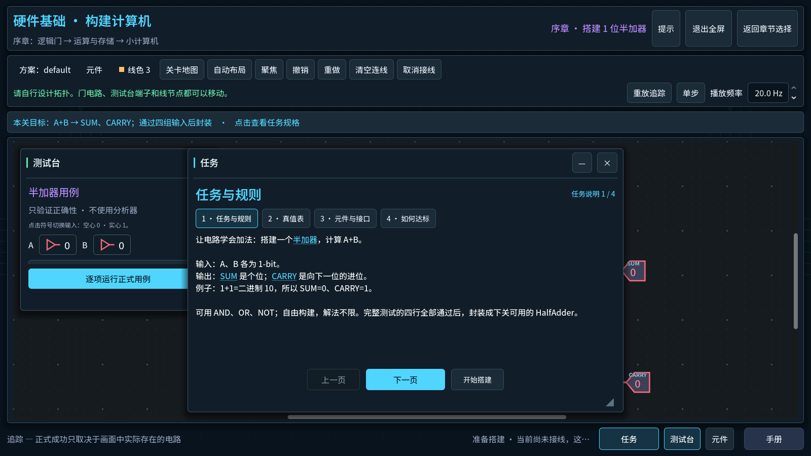
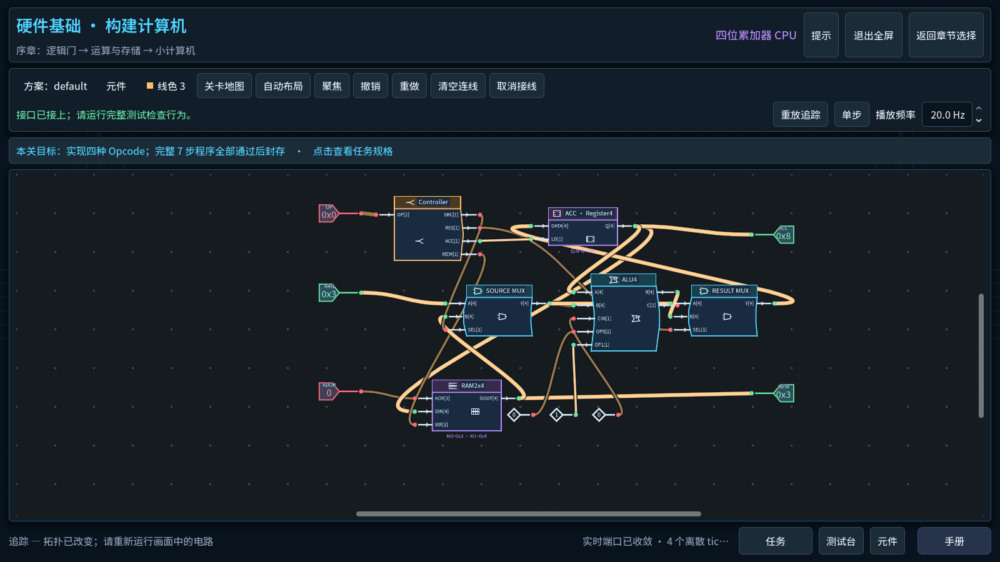
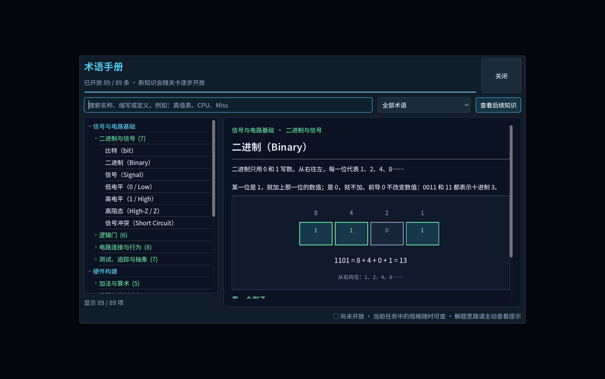

# Mac native play and workbench polish

Baseline display build label: `mac-polish-20260907T085543Z-f15c175` (unchanged by the palette follow-up). This continues latest main `0ad0bff` using
Godot `4.7.1.stable.official.a13da4feb` on Apple M2. The original construction
campaign and both later system chapters remain the default Game route. The
historical Windows package is unchanged; this source has not been accepted as
a new Windows release.

## Changes grounded in play

- Editing and playback occupy separate toolbar rows. Primary test/seal actions,
  restrained instrument accents, dark signal faces and consistent typography
  make the current action and circuit easier to distinguish.
- Mission specifications have compact headings, aligned Half Adder truth-table
  cells and reachable navigation. Map titles wrap within bounded nodes in both
  languages. LOAD/STORE now invites observation of the already wired computer.
- Test actions stay below the scrolling cases. Switching levels resets that
  scroll; inspecting a component preserves other instrument positions and sizes.
- Mac pointer motion with an empty button mask no longer cancels a physically
  held drag. Focus loss ends gestures. Completion and Handbook input cannot
  change the board behind them. Hardware shortcut hints show Command on Mac.
- Wide terminals show complete authoritative values rather than Boolean 1.
  Hexadecimal padding puts zeros before digits A–F: four-bit 12 is `0xC`, not
  `0xC0`. Simulation values, timing and signatures are unchanged.
- The Handbook keeps its 89 topics, 29 illustrated entries and existing unlock
  policy, with a progress rail and signal drawings matching the canvas. Its
  binary diagram consistently shows `1101 = 8 + 4 + 0 + 1 = 13`.

The images below are actual Godot renderer captures from isolated verification;
they are not native computer-use screenshots. The binary image uses the Handbook
availability test fixture (89 topics), not earned player progress.

## Native ordinary Game evidence

These observations used the Mac computer-use surface, entering ordinary Game.
They are separate from Godot viewport-event replay and unit fixtures. No Test
bootstrap, reference-wire insertion or completion setter earned this progress.

| Native activity | Observed result |
| --- | --- |
| Tutorial | Five required actions completed; port wiring, input toggle, precise right-click erase, Command+Z and Command+Shift+Z |
| Half Adder | Alternate player-built topology, four official cases passed and sealed; body drag/undo and a midpoint branch creating JUNCTION_001 |
| Full Adder / ALU | Eight / 32 official cases passed and sealed; ALU H1, H2 and H3 separately requested with confirmations, returning to the empty player design before building |
| Latch / Register / RAM | Five temporal cases each passed; both stored words maintained their own values; RAM used Shift+Home at 77% before accurate port drags |
| CPU | 19 manual wires, A/B/C/D interface stages, all seven instructions passed; TinyComputer sealed |
| LOAD/STORE | The sealed player computer passed all seven fixed program steps; original map marks every prologue lesson complete |
| Handbook and focus | 59/89 topics open after the bridge; Command+A replaces CPU search with Cache; future Cache shows only its unlock condition; Escape returns focus to Handbook entry |
| Modal and numeric input | Number 3 behind completion leaves wire color unchanged; Command+A in playback frequency replaces the value without editing the board |
| Retina/window | Built-in Liquid Retina, 2940×1912 backing / 1470×956 logical display (2×); F11 and native window zoom used, native capture at 1336×768 |

The native arithmetic, storage and CPU continuation used commit `f15c175`.
Its incorrect pre-fix word displays were observed and led to the subsequent
presentation correction. The original player files were copied intact into
`.godot/mac-playtest/cpu-native-save-backup/` before ending the process. Earlier
backups and failed verification logs remain available locally.

## Restart defect and approval boundary

A native restart exposed a pre-existing save defect: `Array[StringName].sort()`
can produce a different component order in a new Godot process. That changes
source signatures and the default seed fingerprint, causing a correct sealed
Half Adder to be rejected and the default workbench to be reset. A read-only
probe of the original saved circuit still passes all four official cases.
Same-process save tests did not expose this problem.

A compatible deterministic-order correction and one-time legacy fingerprint
migration were proposed. Because the user explicitly reserved data changes for
approval, no conversion, signature relaxation or player-save cleanup has been
applied. The complete native progress backup is retained. This issue prevents a
claim of reliable restart continuity until the compatibility fix is authorized
and validated across separate processes.

## Verification and remaining acceptance

Fresh verification uses `scripts/verify-project.py`, a copied project and a
unique Mac player directory for every case, checked by an actual path probe.
- English full Game: `.godot/verification/20260907T085708Z-82f678ac/`, all
  20 suites and 502 viewport-input checks pass.
- Chinese full Game: `.godot/verification/20260907T090007Z-ab01f760/`, all
  20 suites and 502 viewport-input checks pass.
- Final Handbook copy/render check: `.godot/mac-playtest/postfix-handbook.log`,
  558 checks, zero failures; localization and actual directory probe also pass.
- Subsequent native ordinary Game in a fresh isolated directory: Tutorial
  completed again, Command+C/V creates a component and Command+Z removes it;
  Half Adder specification/nav fits the native capture, and its test action stays stationary while
  case rows scroll. This does not replace the earlier original-directory CPU play.

- Final small fixes: `.godot/verification/20260907T091751Z-b7310af3/`, all 20
  suites and 142 Tutorial viewport-input checks pass. This targeted run follows
  the complete bilingual mainline passes above.
- Final native: corrected first Retina window fallback is visibly larger than
  the earlier 800-pixel-wide capture. F11 entered fullscreen; the visible exit
  button restored the window size. Rapid consecutive F11 produced an unstable
  capture, so that gesture is not counted as a clean round-trip pass. The final
  binary diagram and hexadecimal explanation were read in the native Handbook.
- Final original-checkout import is clean. Player-file hashes before/after that
  import match; the original CPU progress backup remains untouched.

The [verification summary](../verification/2026-09-07-mac-native-polish/summary.json)
records source commit `d8c752f`, exact run IDs, pass counts and evidence limits.
The [active plan](../exec-plans/active/mac-native-polish.md) retains intermediate
failures and remaining work.

Do not infer novice comprehension, physical trackpad comfort, mixed-monitor DPI,
Windows EXE behavior or release readiness from the passing suites, automated
replays or agent play. Those are distinct acceptance activities. Existing seed
coordinates, free construction, independent Hint levels, simulation semantics,
source provenance checks and save formats remain unchanged.

## Display API reference

The Mac default window correction uses the documented
[Godot 4.7 display scale](https://docs.godotengine.org/en/4.7/classes/class_displayserver.html#class-displayserver-method-screen-get-scale)
only for the initial fallback size; previously remembered window rectangles stay
in pixels. Usable-screen bounds still constrain the result. Physical multi-screen
behavior needs a separate native check.

## 17:38 screenshot follow-up: component palette

The user's word-MUX/decoder screenshot exposed an actual remaining defect:
unnamed `[1]` port labels overlapped the function glyph and a single port row
collapsed into a narrow rectangular preview. Bounds-only tests missed it.

- A dedicated whole-module miniature now reuses the canvas function glyph and
  family colors, with a readable body silhouette, actual pin count and distinct
  one-bit/word lead widths. The full canvas and placement ghost are unchanged.
- Cards now provide localized names, short purposes, and real input/output counts
  with the maximum port width. Text uses Labels with measured ellipsis instead
  of clipped custom drawing. Placement instructions are shorter.
- Fresh isolated import, directory probe and all 20 suites passed in
  `.godot/verification/20260907T095336Z-b7454d8a/`. The subsequently added internal
  geometry checks also passed in the isolated prologue UI suite. All 19 component
  types were rendered and inspected in Chinese and English; these are catalog
  fixtures, not earned campaign progress.
- Native ordinary Game entered Tutorial with a new isolated save and displayed
  the new cards. It exposed two next fixes: the default palette height hides NOT
  below the fold, and a native card drag arms placement without dropping a gate.
  This round is therefore not a complete native-editing pass.
- The native tool initially confused identical Godot window titles and retained
  a stale menu capture. An independent temporary app identity and window title,
  checked against periodic read-only viewport captures, resolved identification.
  The editor was preserved. The temporary app/capture helper is not product code.

## Native palette follow-through

The next native pass reproduced the two palette issues above and corrected them:

- First opening now sizes the palette against the settled Retina desktop. All
  three Tutorial cards are visible without scrolling, while later player window
  moves and resizes are retained.
- A held native press whose motion omits its button mask can start the normal
  Godot drag payload/preview. A drag preview explicitly preserves its configured
  symbol and labels instead of losing runtime fields through Node.duplicate().
- Drop hit testing and positioning use the release event. Native captured input
  can differ from the physical OS cursor; using that cursor had misplaced the
  item or prevented the drop entirely. Drops over floating instruments cancel.
  A successful drag places one component and returns to editing. Clicking a card
  still supports repeated placement, and each placement remains one undo step.

Fresh ordinary Game, with a unique isolated save and no reference insertion:

| Native action | Observed result |
| --- | --- |
| Tutorial palette | AND, OR and NOT fully visible; localized card text and whole silhouettes readable |
| Drag AND onto canvas | Exactly one component at release position; no extra placement ghost |
| Command+Z / Shift+Command+Z | Removed, restored and removed the dragged component |
| Drag AND onto Test Bench | Cancelled without adding a component behind the window |
| Click NOT, place twice, right-click | Two components placed; placement ended; two undos restored the board |
| Tutorial construction | Manually wired, toggled input, deleted/reconnected a wire; earned 5/5 completion |
| Half Adder construction | Read the two specification pages, manually wired 12 connections; all four official cases passed, sealed, continued to Full Adder |
| Newly unlocked Half Adder card | Readable miniature; drag produced the complete two-input/two-output module; undo restored the initial Full Adder board |
| Handbook | 36/89 terms available; CPU remained locked behind its original prerequisite; Command+A changed CPU search to binary; Escape returned focus to Handbook |
| Retina/window | F11 restored a readable window and returned to fullscreen; component and wire state retained |

The last native system capture after returning to fullscreen has an anomalous
thin strip at its top edge. The read-only Godot viewport capture is clean. This
separates the observed capture discrepancy from game rendering; it does not
establish stable rapid fullscreen switching or physical mixed-monitor behavior.
The test app used a separate temporary bundle identity so the user's editor
session could remain open. No test capture helper is part of the game.

CPU was manually completed in the earlier native round recorded above, not
manually replayed in this palette follow-up. The final automated mainline replay
covers CPU again, and must be reported separately from native play. Save-format
and restart compatibility work remains pending the previously requested approval.

Final follow-up verification uses the exact current runtime/assets/tests copied
in `.godot/verification/20260907T105450Z-7953228f/`: import, actual directory
probe and all 20 suites pass; Chinese and English ordinary Game each pass **528
checks with zero failures**, including CPU and LOAD/STORE. Native observations
above remain a separate evidence stream. The [summary](../verification/2026-09-07-mac-palette-polish/summary.json)
records source hashes, unique player directories and remaining limits. Final
[Chinese](../verification/2026-09-07-mac-palette-polish/palette-zh_CN.png) and
[English](../verification/2026-09-07-mac-palette-polish/palette-en.png) catalog
renders show all 19 card types; they do not represent campaign unlocks.
