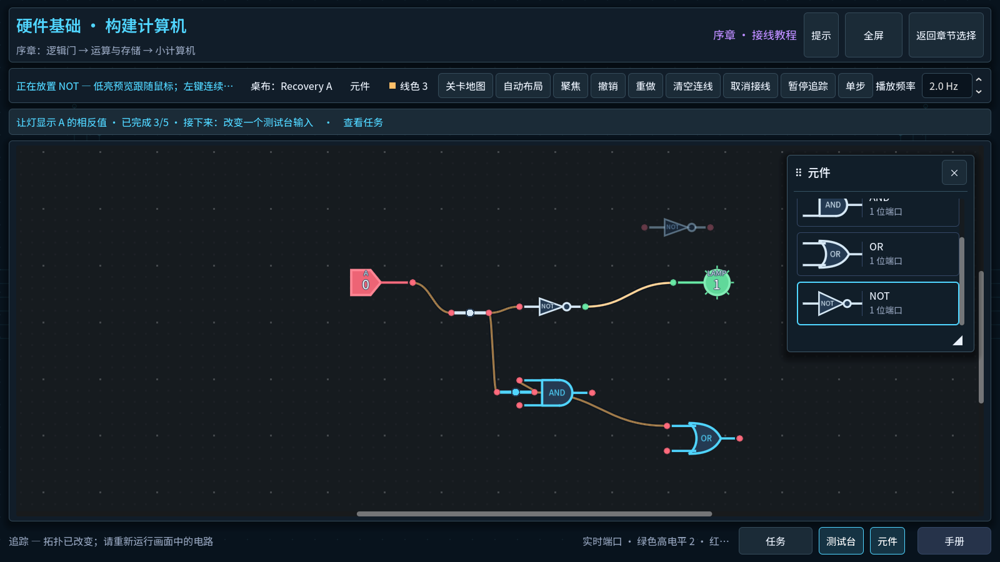
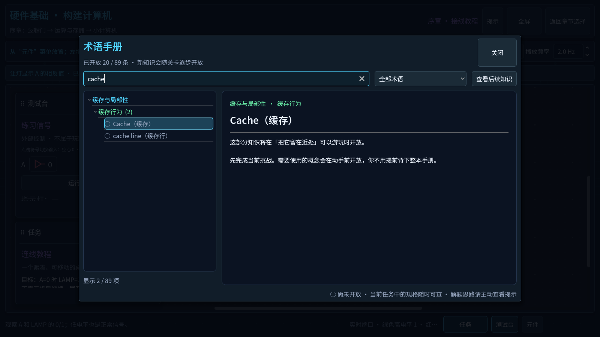

# Circuit visuals and progressive learning

Build `polish-20260907T010358-76ef116` improves the original construction campaign's visual language and learning reference. It is a playable candidate; native desktop play and novice acceptance are still open. The default remains Tutorial → arithmetic/storage branches → CPU → LOAD/STORE → Chapter 1 → Chapter 2. The historical eight-task comparison retains its independent progress and secondary entry.

## Playable package

- ZIP: `build/Von-Neumann-Bottleneck-Polish-20260907T010358.zip` (56,337,399 bytes).
- EXE: `build/polish-20260907T010358/Von-Neumann-Bottleneck.exe`.
- Start the EXE, then choose **Hardware Foundations** on the original chapter hub. Existing original progress can continue. No save conversion or cleanup is required.
- The ZIP contains the executable, bilingual playtest instructions, Noto Sans SC license and build manifest. Archive integrity and embedded file hashes pass.
- ZIP SHA-256: `3d93d4947328c51dab68b5f23ff3835b5b6084c775ab1c006219b6f51ecb7d03`.
- EXE SHA-256: `1dc83a42ca49c0d339f3941aa005c98612e0c8d209f457525a3bab19f563bec0`.

## Observable changes and causes

| Issue | Actual cause | Final behavior | Evidence |
| --- | --- | --- | --- |
| Repetitive, oversized signal inputs | A native switch was combined with repeated signal name, high/low text, number and decorative line | One external signal name; compact outlined triangle + 0 or filled triangle + 1. Red/green is secondary. The existing toggle and keyboard contract remains | Hardware UI tests; CN/EN Game input; Mission image below |
| Component illustration and description do not align | The catalogue scaled a full GraphNode, including title/row layout, into a thumbnail | Same gate/module schematic renderers as the canvas, fitted inside a dedicated preview column; one aligned name and localized bit-width line | Hardware/prologue UI tests check type, component identity, preview bounds and text clearance; full placement ghost geometry remains checked |
| Inconsistent large rounded surfaces and typography | Separate local styles and fallback font metrics across instruments | Shared navy instrument theme, thin cyan emphasis, restrained shadows, procedural circuit backgrounds and chapter emblems; bundled Chinese/Latin typography with regular and heading weights | Rendered original hub, Mission, palette, Handbook, CPU and Chapter 1 entry inspected |
| Handbook overwhelms a new player | Every subject appeared immediately, independent of campaign progress | 20 starting subjects; all 89 mapped to their first playable original lesson. Both branches open naturally. Current Mission specifications are accessible before solving | 558 Handbook checks; all 21 Missions in both languages; actual GUI open/search/return checks |
| Future terms distract or reveal later content | Search and direct links previously treated all entries alike | Optional future-topic titles explain when knowledge becomes available; locked diagrams/examples remain hidden. Opening a Mission term clears stale filters | Locked cache search, direct future entry, current signal search and exact workbench return checked |
| Some explanations mix interface facts, solutions and unrelated concepts | Sparse diagrams; Register LOAD linked to memory LOAD; SR Latch illustration showed reference wiring; Apply text retained the withdrawn redesign framing | 29 illustrated entries, including signal states, binary weights, wire branching versus crossings, truth tables, arithmetic output and storage behavior. Register links to D/Q. SR Latch shows set/hold/reset behavior. Apply describes the original draft/application/run flow | Bilingual localization suite; rendered illustrations; current-stage link coverage |
| Mission repetition obscures task progression | Repeated Half Adder section title, broad early gate explanation and thin CPU completion guidance | Tutorial explains the current NOT task; Half Adder distinguishes task, truth table, interfaces and checking; CPU states the seven-step complete test and the LOAD/STORE continuation | CN/EN Mission navigation and CPU pass/continue screenshots |

The palette screenshot is scrolled to the selected NOT item; the partial preceding AND card is scroll clipping. Its symbol and text share the same clipping boundary. Full placement previews still show the actual canvas footprint and port rows.

## Learning and progression

The Handbook derives availability from the existing original progression and validated player state. It does not add unlock flags, change save schemas or recognize comparison completion as construction evidence. The lookup covers arithmetic, storage, CPU, Chapter 1 and Chapter 2. Specifications needed by the current playable lesson are available immediately; answers remain behind the independent Hint flow.

The new illustrations explain input/output or state behavior, not a preconnected level solution. No reference wires are inserted into the player's board. Original official tests, stage prerequisites, free legal wiring, debug versus full-test execution and playback-frequency meaning are unchanged.

The prior construction pass's persistent objective, direct Mission sections, next-capability preview and explicit sealing/continuation remain available. This pass refines their text and presentation. It does not establish that the entire game's difficulty curve is already balanced for beginners.

## Verification and evidence boundary

Evidence root: `.godot/polish/20260907T003207/`.

| Verification | Result | Scope |
| --- | --- | --- |
| Conventional suites | 20/20 pass after focused assertion updates | Simulation, source/content, saves, localization, original UI, retained comparison and progressive Handbook |
| Original Game GUI replay, Chinese | 461 checks, 0 failures | Fresh default entry; select/drag, place, connect, middle/endpoint branches, precise erase, undo/redo, selection/clipboard, zoom/pan, text focus return, window/fullscreen controls, Mission, H1/H2/H3 confirmations, named workbench return and continued editing |
| Original Game GUI replay, English | 461 checks, 0 failures | Same route; earns both branches, CPU, LOAD/STORE and Chapter 1 entry through ordinary UI |
| Handbook unit/rendered checks | 558 checks, 0 failures | Topic mapping, progress policies, all current Mission links, locked search, diagrams and localization |
| Exported EXE | Game and Test exit 0 | Awaited isolated-process startup; rendered default original hub and unique build ID inspected |
| Native computer-use | Blocked at locked desktop | Game window enumeration succeeded, but fresh desktop capture showed Windows locked. Native input stopped; no full OS-level replay of this candidate occurred |
| Novice play / physical mouse / High DPI | Not verified | Internal 1280/1600/4K render sizes do not establish Windows scaling or physical interaction comfort |

The GUI script dispatches mouse and keyboard events through Godot's viewport. It does not use reference loading, the Test library, progress setters or controller-action calls to obtain ordinary Game unlocks. This is separate from OS-level computer-use. The Handbook unit suite separately supplies progress snapshots to check availability policy; those fixtures are not playthrough evidence.

`final-checks/results.json` retains the initial 18/20 result. Two old presentation assumptions were updated: palette cards now contain the shared schematic renderer instead of a complete miniature GraphNode, and selecting a locked Handbook entry goes through the explicit open path. The new assertions protect bounds, identity, current availability and retained full ghost geometry. Revised passing logs remain next to the failed originals; `verification-summary.json` identifies the final 20 results. The final CN/EN replay logs are `final-zh.log` and `final-en.log`; `handbook-final.log` records the rendered Handbook pass. Passing logs retain a nonfatal Windows root-certificate-store warning and no script/test errors.

Bundling the font changed Godot's hidden GraphNode title layout by one pixel. The placement origin was adjusted from 31 to 32 pixels, with existing exact ghost-to-canvas geometry tests retained and passing. Numeric OpenType weight tags select the intended font weights in this Godot build; the effective coordinates and final rendering were checked.

## Compatibility and protection

HEAD remains `76ef11610c3faf2b81722877fa91877a4589074d`. No commit, push, reset, clean, whole-tree restore or player-data deletion occurred. The 32 pre-existing staged paths retain the exact binary patch from the baseline; this pass and the prior unstaged experience work remain unstaged.

Backup `.godot/polish/20260907T003207/backup/` contains 339 tracked/nonignored workspace files, the staged and unstaged binary patches, status/HEAD and 21 actual Lenovo player files. All 21 player files match their backup hashes at handoff. Tests and executable checks use isolated APPDATA/LOCALAPPDATA. Earlier packages and intermediate diagnostic evidence are preserved.

Seed coordinates, simulation semantics, provenance checks and save formats are unchanged. Original free editing and named workbenches remain the normal Game path. Hint return retains name, topology, coordinates and wire colors; undo/redo and clipboard still clear under ADR 0015. No claim is made that Hint history was redesigned or retained.

## Remaining acceptance

1. Unlock Windows and replay the exported candidate with native computer-use: Tutorial → Half Adder → CPU, including input toggles, port/segment branching, exact erase, Hint confirmation/return and editing after text focus changes.
2. Observe a CS beginner using Mission, Inspector and H1/H2 without H3. Record where the task, signal values, arithmetic/state rules or CPU module roles remain unclear, and whether the next-capability preview motivates continuation.
3. Check High DPI and mixed-DPI/fullscreen transitions on an unlocked desktop. Tune actual clipping/hit-target problems from those observations.
4. Use that feedback for deeper per-level pacing/copy revisions, especially dense CPU overviews and Chapter 1/2. No global beginner-balance or release-readiness claim is made from these automated results.

## References and artwork

The [Turing Complete developer presentation](https://store.steampowered.com/app/1444480/Turing_Complete/) and [developer updates](https://steamcommunity.com/app/1444480) informed consistent schematic vocabulary, open construction and gradual learning. These are design inferences. The circuit backgrounds, chip emblems, controls and explanatory diagrams are original code-drawn artwork; no commercial game assets were imported.

[Noto Sans SC](https://github.com/google/fonts/tree/main/ofl/notosanssc) is bundled unchanged under SIL Open Font License 1.1. The source font, license and attribution are under `assets/fonts/`; the license is included in the playable ZIP.
