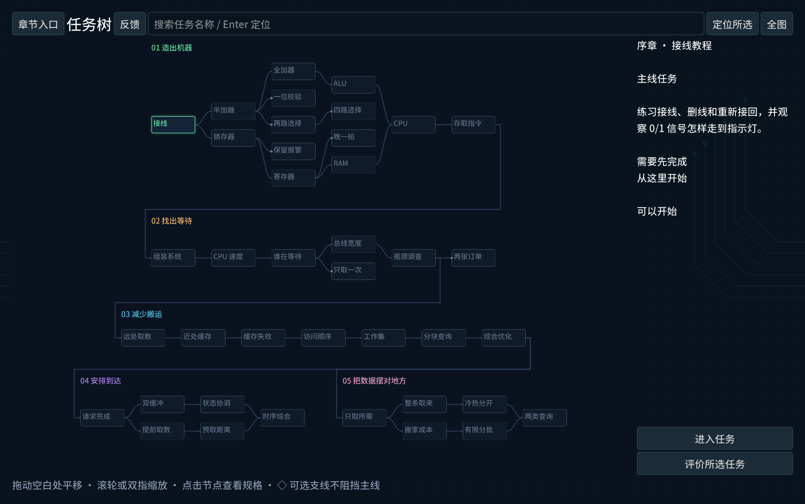

# Five-region free alpha — actual evidence

## M0 baseline

`24d5c22`, main == origin/main after fetch. Original downloaded plan/prompt were the only untracked input files; they remain unchanged. Original player directory not used for testing.

Isolated verification `20260910T145537Z-6be7309f`: 24 suites pass; ordinary Chinese Game input replay **602 checks / 0 failures**. Previous replay coordinate failures are closed for this baseline. This is automation, not novice acceptance.

## M1 native checkpoint (2026-09-10, Apple M2, Godot 4.7.1)

Official engine, normal Game hub → task tree → chapter 4, separate `VonNeumannBottleneckChecks/five-chapter-20260910` copied from the previously earned exploration QA save. No progress flags or reference designs injected into native play. `source=agent_native` in local v2 events. The renamed temporary engine bundle displayed a window but CUA coordinate input reported noWindowsAvailable; the official bundle worked after raising its AX window. No change to the user's Godot installation.

- 4-1: baseline two cases correctly outputs values but fails 128/192 B versus target 64/96 B. Manually moved temperature to a **separate final group**, retaining the other three fields. This differs from Hint 3's field-major recipe. Observed 32/48 B, 49/73 cycles, both pass.
- Command-Z returns to record-major; Command-Shift-Z restores the edited grouping. Saved named scheme **Temp at end**.
- Return to tree exposes both 4-2 and 4-4 choices without automatic next-level navigation.
- 4-2: copied the player's 4-1 grouping. Correct output but **96/128 B**, 120/164 cycles, neither meets its flow goal. Dragged temperature before battery into the record group, using order `[ID, temperature, battery, alarm]`. Observed **32/48 B, 56/84 cycles**, both pass. This is also a non-reference field order.
- Normal quit/restart through the Game hub restored the 4-1 completion, named scheme and unfinished 4-2 draft.

### Issues found by native operation and fixed

1. Saving a name rebuilt/freed its emitting button. Keep nodes alive until the deferred deletion boundary.
2. Native Mac drag motion can omit button masks. Reuse the existing palette's held-input fallback; resolve release after normal Godot drop with a shared once-only transaction flag.
3. JSON numbers restored as floats; field-array lookup/removal using integers silently failed. Normalize new-chapter recipe/group/copy/batch integers on restore. **Native restart → actual drag → changed addresses → successful run** verified after this fix. Add JSON roundtrip editing regression.

## Model calibration

`model-calibration.txt`: actual deterministic engine results over authored workload/recipe variants, not hardware benchmarks. Independent eight-record arithmetic: 8 record-major misses × 16 B = 128 B; contiguous temperatures occupy 2 lines = 32 B. Cycles = 8 lookups + 8 arithmetic + fills ×16 + 1 output = 145 / 49.

Measured tradeoffs: native hot/cold mixed grouping 623 cycles vs record-major 1007; runtime one-shot direct 307 versus temperature copy 557; repeated direct 2456 versus full copy 1362. Batch 4 with 17 records allocates 16 B peak, copies exactly 68 B in five batches (4+4+4+4+1), finishes in 802 cycles. Full copy needing 80 B fails before allocation against 48 B. Mixed task accepts full hot-field copy (2404/1515 cycles) and batched hot-field copy (1364/1131), both with exact oracle outputs.

## M2 native full chapter pass

Continued from the same earned Game profile. All six tasks now completed through CUA operations, without Hint 3 or imported reference schemes.

- 4-3: manually separated temperature, dragged alarm into its group, retained ID/battery together. Group/field order differs from the reference. Both cases **623 cycles / 416 B**; source baseline 1007 cycles.
- 4-4: ran direct baseline (A 307 passes; B 2456 fails), switched only order B to real temperature copying. Both orders pass: A remains **307**, B **442 prepare + 912 query + 8 output = 1362**; **68 B written**, 80 B peak.
- 4-5: selected full copy and observed both cases fail before work: **80 B required against 48 B**, 0 B actually allocated/written. Selected batch mode (4 records) and ran both cases: **802 cycles, 352 B read + 68 B written, 16 B peak**. Event trace starts with actual allocation; exact tail mapping is also checked in the model suite.
- 4-6: copied the player's earlier hot/cold grouping, chose full copy of temperature + alarm. Both cases pass at **2404 / 1515 cycles**, 144 B peak; saved **Full hot**. Switched the same design to batch 4, both pass at **1364 / 1131**, 32 B peak; saved **Batch hot**. Initial/own-best comparison is visible. Neither scheme overwrites the other.
- Hint 1 opens a separate full-screen read-only surface. Requesting Hint 2 requires confirmation; cancelling leaves Hint 1. No answer was applied to the player's design. Hint visual layout and full H2/H3/native focus follow-up are still in the polish queue.
- Final task tree visibly marks **all six new tasks completed**, keeps original Chapter 3 as an independent available branch, and requires both layout branches at the final merge.

Player-facing issues queued from this pass: preparation choice too far down the tools scroll; starting action below the long mission body; scratch preview below the entire source; large traces make tail batches hard to inspect; error/dialog text partly raw English; Hint whitespace/layout. Start action and space/dialog text addressed immediately; the remaining items continue in M3.

## M3 tree, instruments and native iteration

The actual task map keeps all 40 nodes and prerequisite branches/merges. Layout now derives topological columns and region rows from the task DAG; a test adds a sixth region and two tasks without coordinates and verifies all 42 nodes remain in bounds/non-overlapping. Compact overview uses short labels and a completion marker; selecting a node restores full details and zoom. Search and the normal entry action remain available. This borrows the discovery/build/reuse progression described by [Turing Complete](https://turingcomplete.game/), with original assets and existing VNB prerequisites.

Native 1224×768 logical-window observations: the first overview had long status sentences spilling out of small cards, corrected to compact labels; task-specific feedback was saved locally from Tutorial's map selection. The feedback panel initially scrolled its Close/status away, corrected to a pinned header/footer. Default layout instruments obscured each other; initial entry now opens Tools + Mission, starting opens Memory, running opens the comparison panel. Memory rows/values and field legend were enlarged. Shared popup/list/scrollbar styling removes stock gray dialogs; reduced motion is available in Settings.

Native 4-5 restored the earned batch-4 scheme and reran **802 cycles, 352 B read, 68 B write, 16 B peak**. Filtered actual batch-boundary events and selected allocation at cycle **736**: scratch display showed exactly record **#16–16**, temperature value 30 at address 288. H1, separately confirmed H2 and separately confirmed H3 opened the independent read-only mapping; Return → Run preserved the player's 802-cycle result. No solution was applied.

## M4 local feedback loop and metric calibration

Upload defaults off, production endpoint empty. Opinions are explicit and may be saved for an unfinished or selected task; ratings are optional, 0 becomes absent, revisions retain history while reporting the latest per visit. Moment/exit controls are hidden for unrelated map selections. Server reports preserve original event sequence, so same-second receipt order cannot reorder revisions.

Final synthetic Godot → loopback HTTP → SQLite integration: `.godot/feedback-integration/381046df-d9f1-43a7-9563-1e59399b55af/result.json` PASS. An offline first process retains a queued event and can still simulate. A second process loads that queue and sends it; duplicate retry leaves one event row. Opt-out stops automatic collection, separate explicit opinion sends while automatic sharing is off. Final database: one synthetic event + one synthetic opinion, both source `automated`. No real player logs sent. Receiver contract tests validate payload/size limits, owner-scoped deletion, private report authorization, atomic dedup conflict and backup/30-day retention. Python report calibration distinguishes a branch action from 3 added edges, component deletion from incident edge removals, undo, debug calls, one official run from its 32 cases, deduplicated exports and missing scores.

## Current automated and restart results

`20260910T163446Z-9eeeac13`: all suites plus Chinese ordinary Game **602 / 0 failures**. `20260910T165018Z-3c28a567`: latest tree/instrument/context/sequence changes, all **30 entries** (import, isolation probe, 27 conventional suites, English Game) PASS; English Game **602 / 0 failures**. These are input replays, not human comprehension tests. Earlier failed snapshots remain diagnostic: remote autoload preload scope; Handbook old term-count expectation and typed ternary array, corrected then rerun.

Three independent legacy save processes on the latter copy (`.godot/save-restart-21bd57ee`): writer, migration reader and stable reader all PASS. Original player directory remains untouched. The historical `overlap-20260909` QA save and backup already lack CPU/LOAD-STORE completion/reward, so they cannot establish the pre-failure original design; no speculative completion repair or validator weakening was applied. Fresh earned native exploration profile and current automatic complete construction route restore correctly.

## Remaining acceptance boundaries

Windows native execution, another-Mac clean installation/notarization, and real new-player comprehension, difficulty, enjoyment and long sessions remain unverified. Candidate packaging and final native polish evidence are recorded below as completed; export alone never closes those external gates. No public deployment, Steam submission or release has occurred.

### Final source-native visual pass

After the latest import, ordinary Game → tree → 4-5 starts with Tools and Mission only. Start Arranging hides Mission and opens Memory; Run shows three **non-overlapping** columns at 1224×768. Both restored orders still produce 802 cycles. Larger colored memory cells are readable, and the H2 confirmation now uses the shared navy/cyan theme. The long optional feedback settings scroll while Close remains pinned. Automatic sharing remains disabled with a clear unconfigured-endpoint message.

Tutorial: click placement, Escape cancellation and actual palette-to-board drag create a single NOT. Command-Z removes it and Command-Shift-Z restores it. Delete removes the selected test component. Native BackSpace did not act in the earlier build; a scoped fix now handles it through the same undoable delete transaction and adds a text-focus regression (final validation below). A rapid Cmd-Tab/raise sequence did not establish a reliable focus-loss cancellation observation; that native boundary remains open rather than claiming a pass from notification tests.

Half Adder: restored previously earned player wiring, debug and the four official cases through normal controls all pass, showing the completion overlay. CPU: restored own previous wiring, typed-width inputs and scalar/square bus markings visible; official seven-step playback performed (final result below). No references or unlock injection used for these rechecks.

CPU final native result: all seven program steps passed and the ordinary completion overlay was shown. Normal quit preserved the QA profile. The private report helper also generated JSON and HTML from the synthetic integration database locally; no report was published.

The final native session log was checked as aggregate events only: Tutorial records two actual placements (each one component), one delete (one component), two undo actions and one redo; these are not recounted as new placements. Half Adder records one debug and one official run with four cases; CPU one debug and one official run with seven cases, both passed. This calibrates those native operations without copying raw player/agent logs into Git.

Final Chinese ordinary Game run `20260910T170449Z-309ccbf8`: all 30 entries pass, including the new BackSpace text-focus/delete/undo regression and 602 Game checks. Candidate-only capture/reset argument guards are verified on the exported binary below, rather than assumed from editor tests.

Renderer capture at 2940×1846 backing pixels, fresh automated session (locked progression), current real scene. It documents layout, not native completion or a promotional mock-up. Native observations above were separately performed through CUA.
