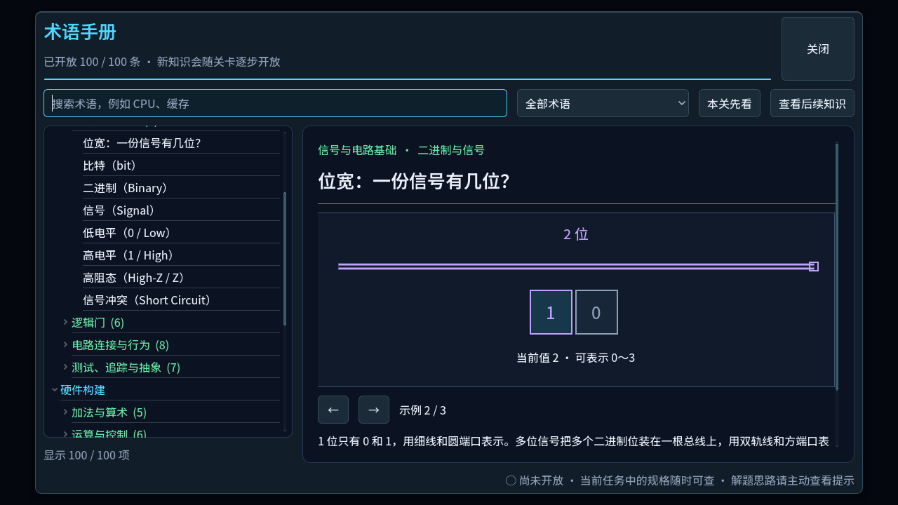
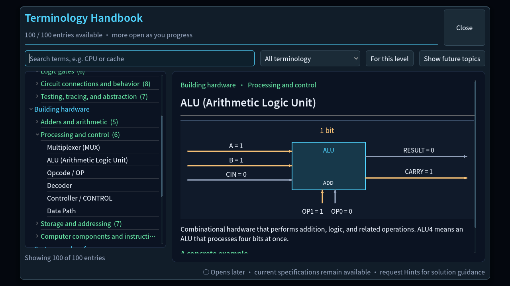
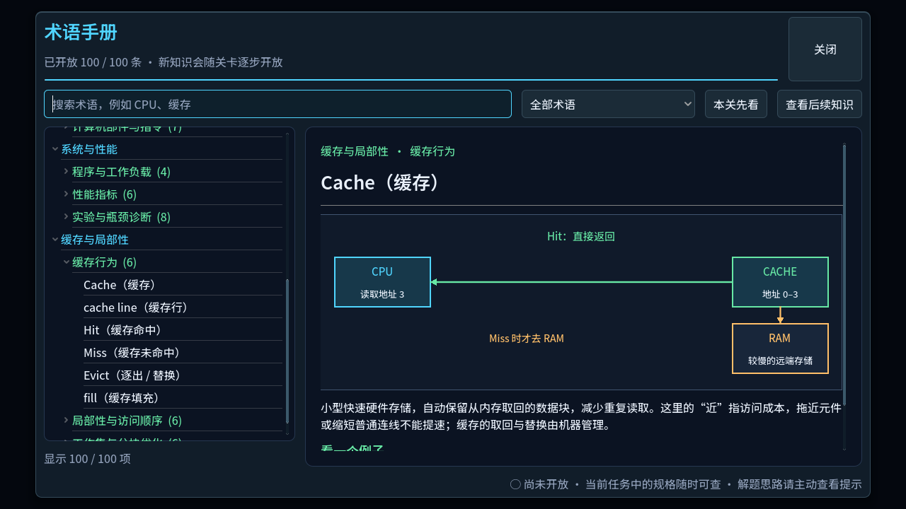
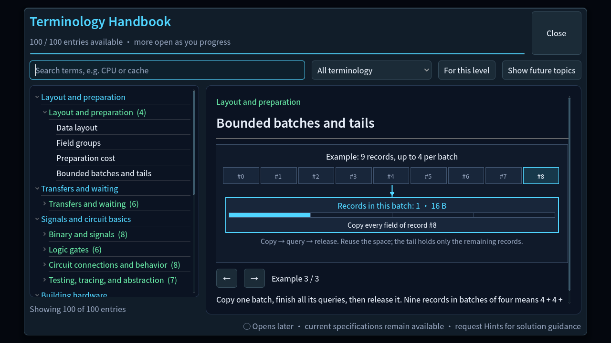
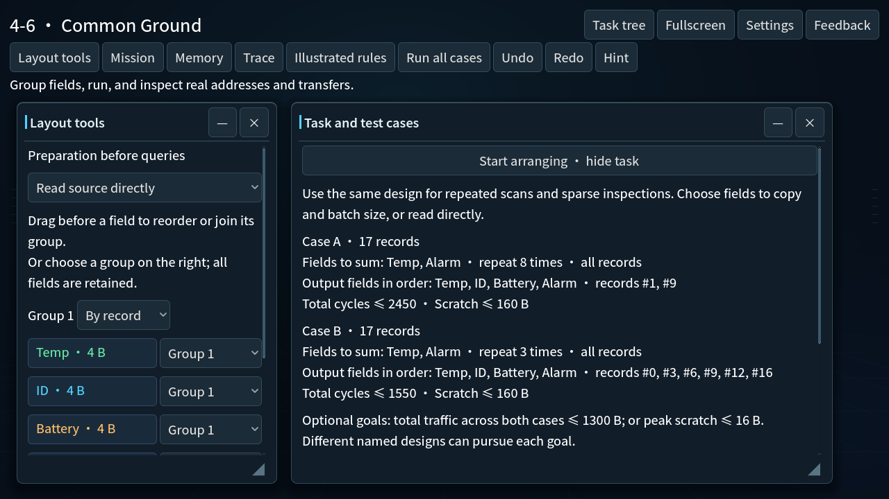

# Wire feedback and readable guidance — 2026-09-14

Active iteration, requested by the owner. These are source checks, not a new
exported candidate or external beginner acceptance.

## Wire feedback

- The bus value badge and cable reveal use the same path fraction.
- Paused badges resolve current endpoint geometry after canvas movement/zoom.
- Branch and reconnect origins remain attached to the current curve/port;
  release resolves the current split position. Preview/cancel do not alter topology.
- Reduced motion displays stationary wave feedback without changing the wave clock,
  simulation events, metrics, connectivity or zero wire latency.
- Hover validation is pure. Passing an incompatible port does not leave a red
  diagnostic behind; an actual rejected release displays the reason and counts once.

## Mission and Handbook review

All 40 Mission specifications were compared with their catalogs/models (source
review, not 40 new native completions). Corrections distinguish summing from ordered
output and repeated queries from multiplication; clarify conditional partial batches,
ALU4 carry behavior and the already-applied Chapter 1 starter program.

New/revised illustrations use real layout mappings, record identity, 4 B cells and
16 B memory lines. Field groups are separate from record/field order. Preparation
shows read, write and query as separate steps. Batches show 4 + 4 + 1 records and
actual 64/64/16 B occupancy. Width examples introduce 1/2/4 bits one at a time;
bit weights remain in the binary entry, instead of competing with width labels.
Cache Hit arrows now return to CPU; the ACC sequence no longer returns to a stale
value. MUX and ALU examples use the actual first-lesson one-bit interfaces, with
separate result/carry and OP controls. Their outputs are checked against the
authoritative simulator. Only the existing progressive handbook policy controls availability.

## Fresh checks

- `.godot/verification/20260914T031854Z-16f224d4`: 40 regular suites,
  isolated user-directory probe and import passed. Ordinary Game Chinese scripted
  input: **634 checks, 0 failures**.
- `.godot/verification/20260914T032755Z-76dd555a`: revised Handbook,
  layout UI and localization passed; English ordinary Game scripted input: **634 checks, 0 failures**.
- Final Handbook renderer fixture captured 36 Chinese/English frames covering all
  steps of width, data layout, groups, preparation, bounded batches, MUX, ALU, ACC
  and Cache at **1280 × 720**. Initial captures also included scaled/Retina rendering. This explicitly unlocked
  fixture verifies drawing, not player-earned progress. See `capture-guidance.gd`.
- First run `20260914T030419Z-787e72ab` failed new geometry test setup
  (missing validator/overlarge movement threshold) and a stale curve used after
  test zoom restoration. These test defects were corrected and narrow suites passed
  in `20260914T031247Z-99253fef`. Its final LOAD/STORE GUI route also failed;
  later complete Chinese and English runs passed, but no definitive root cause for
  that first route failure is claimed.

## Actual native boundary

A copied synthetic QA Tutorial profile was opened through the normal Game entry,
with a new `VonNeumannBottleneckChecks/wire-guidance-native-20260914` directory.
Native Tab/Return entered Continue, located the completed Tutorial in the task tree,
entered its normal Mission/Tools view, and Command-Q exited normally.

Mouse calls repeatedly returned `noWindowsAvailable`, even after raising/focusing
the QA app. This turn therefore **does not close** native mouse drag/branch/reconnect
or held-pointer pan/zoom acceptance. Renderer captures and scripted input are
separate evidence. The user's own editor/profile was not used for gameplay.

Windows real-machine, mixed-monitor DPI and external beginner feedback remain open.
The existing `free-alpha-60de5e54c95d` candidate predates these changes and has not
been overwritten. No public release or server deployment occurred.

## Final focused recheck and captures

`20260914T033559Z-b6ab3a8b`: wire drag/hover, hardware UI, Handbook and
localization all pass after the final repairs. The prior hover-fixture run failed
on dynamically constructed untyped arrays; explicit typed port/width arrays and a
fixture-completion assertion fix the test. The verifier correctly rejected its
misleading outer PASS line when script errors occurred.

Static screenshot capture explicitly forces a render frame: waiting for another
`frame_post_draw` could stall when no next frame was requested. Window dimensions
are logged per capture. The final renderer completes with no GDScript errors; macOS
prints an IMK input-method shutdown message after completion. This is not treated
as input-method acceptance.

Wire stage commit: `2d5662c`.

## Next reading-order iteration

At 1280 × 720 the English mixed-layout Mission put optional goals, batching and
grid reminders before its actual test cases; only the first case reached the
initial viewport. The Mission now puts the goal and both case specifications first,
then the retained optional goals/new-tool rules. Ordinary single queries no longer
add a redundant “repeat 1 times”; repeated queries remain explicit.

`20260914T034332Z-49b06ea0`: layout UI and localization pass. Eight bilingual
Mission frames (fields, records, batches, mixed) were rendered with the same window
size. The final mixed-layout initial view shows both cases and their separate limits.
No queries, models, win conditions, fields, constraints or tool access changed.

## Final low-noise controls and input replay

Handbook search hints now fit the compact English field. The diagram strip shows
only its example number; previous/next buttons keep the no-design-change explanation
in localized tooltips. Search still covers name, abbreviation and definition.

`20260914T035109Z-30e013a6`: Handbook/localization pass, and final Chinese Tutorial
input replay completes **242 checks / 0 failures**. Its evidence helper now forces a
render and checks PNG writes rather than indefinitely waiting for an unsolicited
next `frame_post_draw`. The previous idle run `20260914T034748Z-f2305cdf` was
terminated as incomplete; it is not counted as a pass. The current 36 final Handbook
frames render at 1280 × 720, with the selected images above refreshed.

A further native attempt launched official Godot into a separate QA profile. The
computer-use API only identified the pre-existing editor, so no UI actions were
sent to it. Only the new isolated Game process was terminated. Native mouse
acceptance remains open; keyboard and replay evidence are not substitutes.
