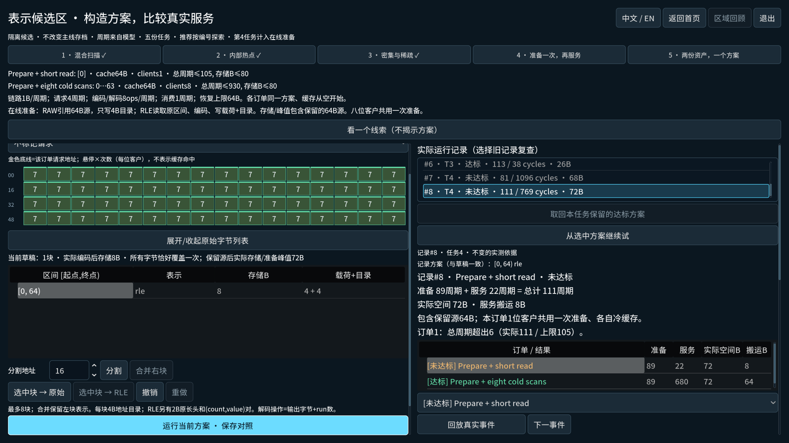
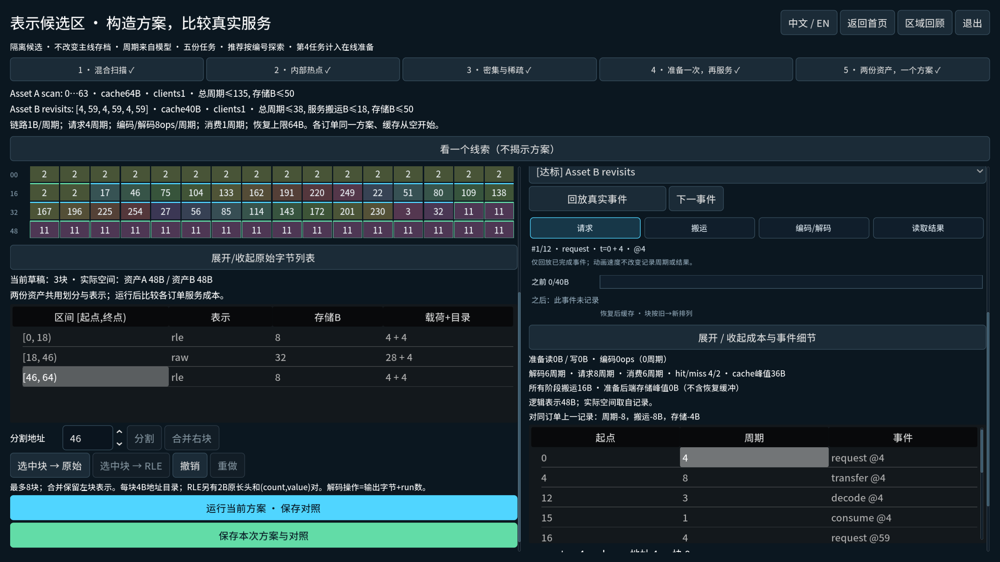
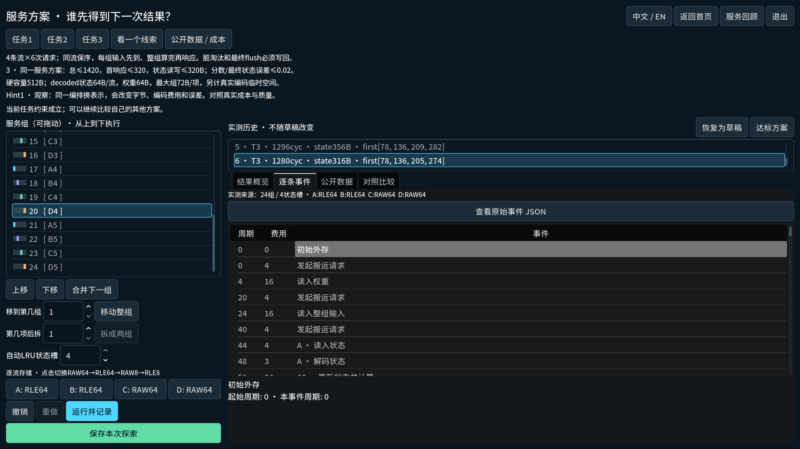
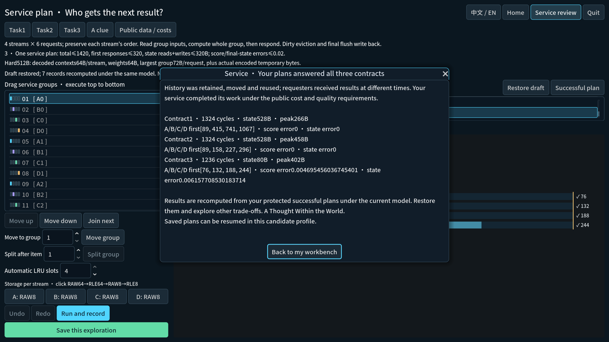

# Mac second-act candidate — 2026-10-05

Branch `codex/mac-second-act-20261005`; baseline `c5a2b0c`, integrated source
`d5767ed`, corrected executable source `9cb3f92`. Godot
`4.7.1.stable.official.a13da4feb`, Apple M2 / macOS. This is a source candidate,
not a published update or accepted exported app. Original dirty collaboration
files were neither overwritten nor committed. No real player saves were used.

## Delivered journey

The isolated hub offers Representation and Service Plan independently. A named
profile retains its original representation/service sibling directories, separate
files and separate locks. Neither entry grants core40 progress. Representation's
five tasks retain their goals and valid solutions, with primary preparation,
service and actual-space results, an all-order table, expandable details and
immutable record provenance. Service retains its three contracts, editable groups,
measured response evidence, explicit save, guarded Home and a protected-plan review.
Prediction remains optional. Simulation models, candidate schemas and production
save formats are unchanged.

## Exact source and necessary regression

Full frozen `d5767ed` run:
`.godot/committed-verification/20261005T185246Z-f5f1bc3a/receipt.json`.
All 1756 copied tracked files matched; checkout clean before/after. 72 checks:
import, isolation and 70 conventional suites. 71 checks passed. Lifecycle failed
because the final capability-handling revision returned an untyped empty array
from a conditional expression. The suite printed PASS, but the verifier correctly
rejected its SCRIPT ERROR. Its failure and full log remain preserved.

`9cb3f92` clears/returns the typed PID array instead. No other executable file
changed between those commits. Exact corrected-source receipt:
`.godot/committed-verification/20261005T185502Z-24f4e413/receipt.json`:
import, isolation, lifecycle and protected supports all PASS; no source mismatch.
Mac lifecycle has 225 checks, no skip, and includes independent writer exclusion,
abrupt kill, two competing reclaimers, malformed/foreign identity refusal,
byte-exact owner/save retention and transaction faults. Supports exceed 100/80
history caps. This is full regression plus affected-source repair verification,
**not** a claim that a second complete full run passed on9cb3f92.

Initial focused service viewport failures were repaired without weakening tests:
guidance uses Hint and review scrolls inside a bounded dialog. Final focused
service check `.godot/verification/20261005T185109Z-c2a39ca7` passed both suites.
The full run subsequently passed these same service sources.
Read-only integration review found no actionable issue.

## Mac rendered viewport input and process restart

`play_journeys.gd` uses actual viewport mouse/keyboard dispatch from the shared hub,
constructs authored QA solutions through visible controls, encounters real failures,
saves, returns Home, re-enters and opens measured closure. It does not set progress,
load a reference solution or assign a winning draft. A second independent process
uses `--journey-resume` to restore the same UI-earned saved profile. These are
known-answer input replays, **not OS pointer input or novice discovery**.

| Isolated route | Checks | Failures |
| --- | ---: | ---: |
| Chinese Representation, all five tasks, Save/Home/review |173|0|
| Independent English Representation restart/review |14|0|
| Chinese Service, all three contracts, Save/Home/review |161|0|
| Independent English Service restart/review |14|0|

Evidence: `.godot/night-native/{representation-viewport,representation-restart,service-viewport,service-restart}`;
logs `.godot/night-{representation-viewport,representation-restart,service-viewport,service-restart}.log`.
The frozen launcher project is
`.godot/committed-verification/20261005T185502Z-24f4e413/checkout/.godot/experiments/48f8042bad61/project`;
profile `nightQA-20261005-9cb3f92`. Representation and service files were kept in
separate sibling directories. Fullscreen/locale QA preferences belong only to this
candidate profile. Occasional macOS IMK mach-port messages occurred; no SCRIPT
ERROR, ERROR: or FAIL remained in any passing replay log.

Actual examples: single-block RLE in preparation task gives89 preparation +22
service =111 cycles, exceeding the short-order 105-cycle limit, despite the other
order meeting its target. Service grouped exact singleton order gives 1324 cycles,
528B state traffic and first responses89/415/741/1067, failing contract2 by 747
cycles for D. Four-slot interleaving with RLE64 A/B and RAW64 C/D gives 1280 cycles,
316B state traffic,458B peak, firsts78/136/205/274 and zero errors, meeting final
contract. All-RLE64 is a genuine 356B traffic failure. All-RAW8 is a legal bounded-
error alternative; the last saved successful support may therefore differ from
the earlier lossless record. No target was lowered to fit these examples.






## OS-native and package limits

The same source candidate was launched without a replay script. CUA observed the
original five region cards, chapter-task-tree entry, core review and candidate
entry, toggled fullscreen/windowed with the native shortcut, and normal Cmd-Q
ended the QA process with exit0. No errors appeared in `.godot/night-os-native.log`.
CUA binding was slow and every pointer click/scroll then returned
`noWindowsAvailable`, even after raising and rebinding the live window. Native
edit/run/save and native candidate completion remain BLOCKED; screenshots or
keyboard toggling cannot replace them. No security settings were changed.

`~/Library/Application Support/Godot/export_templates` exists but is empty.
Matching4.7.1 templates are absent, so export and actual `.app` acceptance are
NOT_RUN. No template installation, paid signing or public deployment was attempted.
Novice understanding, full manual core40 playthrough and audio are NOT_RUN.
Unknown/previous-boot/incomplete leases still require preserving the whole profile,
closing every candidate window and operator review; never blindly delete locks or
saves. Process-interruption evidence is not power-loss durability.

Push was rejected by automatic approval review as unverified sensitive-source
and-history egress to the GitHub remote. No remote write occurred or workaround
was used. Local commits remain reviewable; only explicit destination/payload
approval can unblock that separate action.

## Reproduce and next smallest step

From the repository root:

```sh
python3 scripts/run-experiment.py representation_region --godot .godot/tools/godot-4.7.1/Godot.app/Contents/MacOS/Godot --profile my-second-act --journey
```

`service_plan` is also accepted. Either launch shows both entries and resolves the
same profile name for each separate domain. Omit `--journey` for existing standalone
candidate behavior. Do not use the production data directory for QA.

Next: restore CUA pointer control or perform a short manual Mac edit/run/save/restart
check; install matching official templates when authorized/available, then export
and test a frozen candidate app. Conduct a novice R4/R5 and service-fairness pass
before formalizing these candidate regions. No additional content is needed first.
