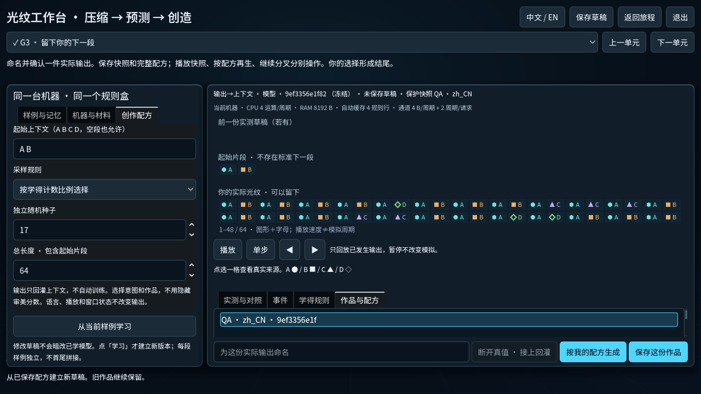

# 压缩 → 内容预测 → 创造：候选交付与团队审阅

2026-10-08。基线为真实开发线 `bf0299f75065b5b44050472f5a6b08855dc4ac41`；
先保护本地配置与 UID，再将该开发线快进到本地 main。新内容是三个候选章、九个
内容单元，沿用一个光纹工作台、同一个有限上下文模型和实际机器参数。
不是正式艺术版、真人教育效果结论或通用智能演示。

## 打开与作品

本机项目检查点：`build/creation-20261008/`，内含 Godot 4.7.1 stable 和已导入项目。
这是可运行项目，**不是导出的发行 EXE**。

- `Play-Journey.cmd`：从已有旅程进入，找到「压缩 · 候选」。原 40 任务及既有
  第二幕仍在；新路线是推荐链接，没有强制完成旧合同的硬锁。
- `Play-Workbench.cmd`：直接进入工作台，与上项共享独立玩家 profile。
- `Review-QA-Works.cmd`：打开另一份独立知解 QA 档，含两件已实际保存的作品。

三个启动器的玩家数据留在检查点目录的 `player-runtime/` 或 `qa-runtime/`，
不使用原玩家目录。QA 档可修改；仓库中的原始作品与完整配方保留在
[works/viewport-session.json](works/viewport-session.json)、
[中文 QA 作品](captures/qa-work-zh_CN.json)、[英文 QA 作品](captures/qa-work-en.json)。
从作品架选择作品可分别「播放快照」「按配方重放」「继续修改」；分叉不覆盖旧作。

其他机器可从仓库根目录运行：

```sh
python scripts/run-experiment.py creation --godot <Godot-4.7.1> --profile Creation-20261008 --journey
```

入口、返回、机器资源带、三轨光纹、单元格／事件定位、双语、脏状态退出、
保存恢复和作品架均已实现。跨次保存恢复草稿、模型、完成依据、作品；
**未完成的一轮逐步预测游标不作为断点保存**，重新打开后重新开始该轮。

## 当前范围

| 章 | 已运行的候选内容 | 继承的实际作用 |
| --- | --- | --- |
| C 压缩 | 无损复原；公平 RAW 与预测包比较；不同机器的成本条件 | 接收端只拿真实包，模型、修正、头部、填充、校验均计字节 |
| P 内容预测 | 提交后揭晓；一项／两项上下文；训练回看、位置背诵与冻结检查 | 使用同一冻结模型；未来原稿不进入模型调用；检查揭晓后标为已见 |
| G 创造 | 主动断开真值、连接输出回灌；修改意图；命名选择、保存与分叉 | 输出回到上下文而不自训练；全配方含样例、模型、机器、种子和版本 |

准备成本与运行成本分别展示；CPU、有限内存、自动规则缓存、通道和请求开销
来自实际事件。早期门电路是玩家构造来路，不冒称逐门执行本模型；不同域的
周期不混排行。没有隐藏审美分数，也不把通关写成壹的诞生。

## 真实反例与作品差异

原始测量：[calibration.json](calibration.json)。这是公开候选材料的已运行 QA，
不是人类偏好或普遍泛化能力证明。

1. 长度 1,536、两项上下文：RAW **436B**，预测包 **401B**。默认机器耗时
   **13,134 / 152,777** 周期，包更小却更慢。机器改为 CPU 64 ops/cycle、
   通道 1B/cycle、缓存 21 行、请求开销 64 cycles 后，同样数据为
   **225,601 / 216,375** 周期，优劣反转。此处多项条件改变，不归因于单一参数。
2. 默认样例 ABAC 与 ABAD：一项上下文在训练首样例 **16/22**、练习 **7/10**、
   首次冻结检查 **11/14**；两项上下文分别 **22/22、9/10、14/14**。
   固定位置背诵检查 **7/14**，确实装载 24B 示例并计 109 周期。
   这些是有限材料的观察，不把一次满分等同于通用智能。
3. 固定种子 17、初始 AB、长度 64 和机器，仅将第二个训练例从 ABAD 换为 ACAD，
   两件作品有 **12 个位置不同**，完整配方均重放一致。实际作品：
   [作品 1](works/calibrated-1.json)、[作品 2](works/calibrated-2.json)。
   输出差异已计算并可回看；哪件更符合意图由人判断。



## 验证边界与原始记录

运行源码哈希见 [source-sha256.json](source-sha256.json)。证据分别绑定执行时源文件，
最终存档校验修补与此前全量／viewport 记录明确分开，不以旧记录覆盖新改动。

- **PASS**：修补前全量 105 个 Godot 套件，加导入／用户目录隔离，共 107 项。
  记录：`full-before-save-hardening/`，运行 `20261008T080833Z-11fcde46`。
- **PASS**：最终源码三个相关套件（合同、旅程导航、工作台）及导入／隔离。
  记录：`final-targeted/`，运行 `20261008T081944Z-9abfd868`。
- **PASS**：最终源码独立写入、分叉、重开三个进程；见 [restart/results.json](restart/results.json)。
  最终校准也从同一源码重新运行，见 `calibration.json`。
- **PASS**：修补前 viewport 472 项，双语 1280×720、两次模式转换、内存失败、
  保存与重放，十张截图；见 [viewport.txt](viewport.txt) 与 `captures/`。
  此后的改动只收紧数据校验，不改变控件，最终工作台 headless 已复测。
- **PASS**：普通 40→49 节点；真实 candidate flag 下 51→60 节点，
  [导航证据](candidate-navigation-results.json)绑定未再改动的三个导航文件。
- **PASS**：最终本地项目的旅程与直接工作台启动；见 [checkpoint.json](checkpoint.json)。
- **PARTIAL**：Python 品牌／试玩报告检查通过；三个未改动的服务器套件进程失败，
  日志均为 Windows Python 3.14 在清理仍被 SQLite 占用的临时文件时出现
  `WinError 32`，没有把这些失败写成 PASS。完整输出保留在 `python/`。

[各批证据源码哈希](evidence-source-sha256.json)明确标出与交付版的差异。
未重复整套旧域测试；存档收紧仅重跑受影响路径。远端 CI 状态不由本地结果代替。

已解决失败原始输出保留在 [resolved-failures/](resolved-failures/)：伪造预测数值、
1280×720 控件越界、测试脚本直接继承 autoload 的编译错误。
终审进一步将完成依据绑定到正确检查类型、已见标记和实际保存作品；
未来配方内的模型版本保留快照只读回看，拒绝重生成和覆写。

**未验收**：原生操作系统输入的完整新路线、未看答案的新手发现、真实时长、
试听、最终艺术表现、跨设备兼容。Viewport 输入是已知答案的可操作性 QA；
部分文本由测试直接设置，不能冒称真人自然输入。当前光纹静音完整成立。
存档保护是完整性／兼容保护，不是对任意改写本地全部数据的防作弊承诺。

## 团队／Claude 交接

本轮三条实际子线程分别完成模型／成本、玩法／呈现、独立验证／成果保护，
主线程负责共享合同、会话、旅程集成与检查点；GUI 串行。唯一执行计划见
[执行计划](../../exec-plans/completed/compression-prediction-creation.md)，
[模型合同](../../../experiments/creation/CONTRACT.md)定义数据与事件边界。

下一次审阅只需看三个片段：一次成本反转、一次揭晓后的预测失误、两件有意修改的作品。
请同学不看答案先玩，记录停在哪里、按了什么、如何解释；不要先教主题再拿复述当成功。

- Claude 可先精修 `experiments/creation/catalog.gd` 的局部文案、
  `signal_view.gd` 的光纹显示与 `workbench.gd` 的局部呈现；主创选择审美方向。
- 改显示映射须保留已有 `light-shapes-v1` 快照语义，必要时新增映射身份，
  不能重新解释已保存的符号。不要直接修改模型真值、成本、冻结检查或作品配方。
- 语义改动由 GPT／开发者对照合同与真实事件审阅；新证据必须绑定新源码。
- 需要人回答：玩家是否知道小包为何仍慢、是否分清背诵与新前缀预测、
  是否能说明样例／上下文／种子如何改变自己愿意留下的作品。

本轮在三章候选和可运行项目处收口，不扩第四个领域。
