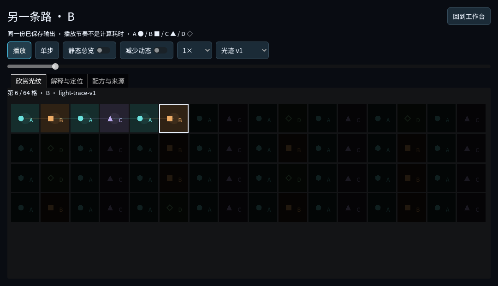
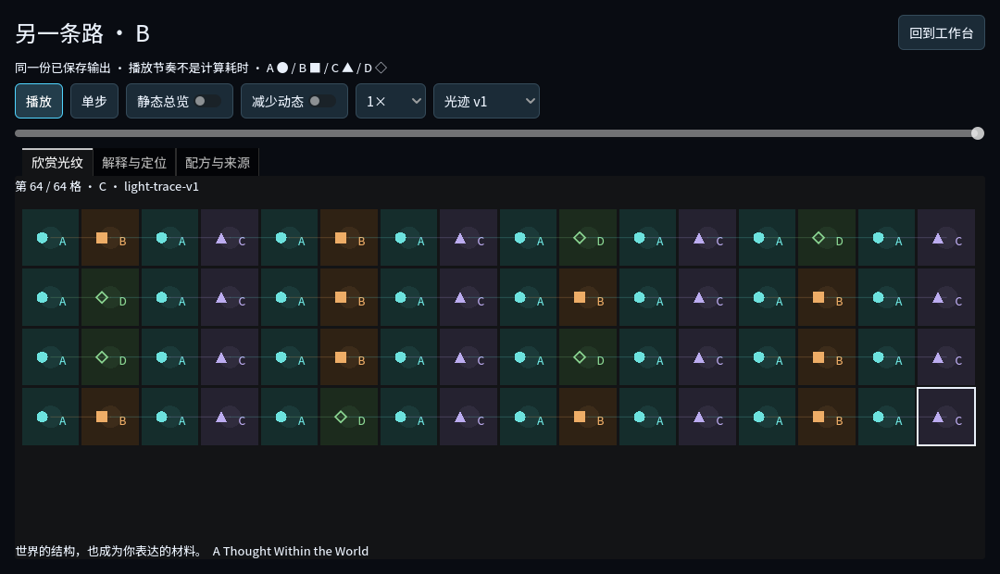

# Representative C→P→G completion audit

This audits the user goal against current implementation, the proposed round brief,
and actual runtime evidence. It does not redefine the goal as test success. The
previous round made implementation progress; this continuation checks weak proof
rather than reopening unchanged systems.

| Requirement | Authoritative implementation and proof |
| --- | --- |
| Discover structure, learn usable rules | Public sample5 has stable ABAC structure and a rare BA→D successor. Actual learning produces counts and model identity. The rendered route trains it and uses its exact rules; prediction calibration compares history1/2 with actual byte/cycle costs. |
| Earlier results serve later creation | Updated rendered route retains the exact learned model through both C orders, independent P practice/check, then generates feedback output before any author sample edits. `carried_generation` stores the full output/recipe/events; C and P report identities must match. |
| World constrains computing | Two public delivery deadlines, same source/model, CPU-only change, actual complete costs and explicit RAW/predictive choices. Memory limits reject insufficient prediction capacity; model preparation is charged and distinguished from run cost. |
| World structure enables prediction | Commit preserves the sealed prefix; Reveal alone appends truth. New same-family practice/check identities have separate seen tracking. Actual history2 improves17/22→21/22 against history1 at greater memory/cycle cost, not an aesthetic or universal intelligence score. |
| Intentional examples/model choices affect works | Fixed seed17/AB/64/machine/sampler, ABAD→ACAD in one selected sample. Actual12changed cells, first10 with sharedCA and real counts. Seed-only is not design evidence; equal output remains valid observation without claiming an effect. Strict replayed receipts retain source attribution. |
| Dynamic work beyond metrics | Saved-work appreciation removes cost tables, shows the exact64symbols through a deterministic16column light layout with persistent traces. Actual rendered clock and viewport controls now establish Play→Pause→held cursor→Step→resume→end, not manual `_process` or `seek` alone. |
| Appreciate, save, replay, continue editing | Named protected A/B, actual gallery/focus/explanation on the same work/cursor, recipe return/fork. Previous independent process20checks prove original bytes remain intact, matching regeneration, legacy viewing and distinct child. Current route also returns to the protected B recipe. |
| Stable mapping and accessibility | Old light-shapes-v1 stays selectable without rewriting old work. New light-trace-v1 is a viewing mapping, symbols/positions/order deterministic. Speed affects presentation only. Reduced motion blocks auto-advance; explicit steps/static view and silent play remain usable. |
| Natural continuous playable route | Real C order buttons→new prediction commit/reveal→disconnect truth→feedback→explicit sample modification→first divergence→named Keep→work performance→fork return. Current rendered route records the whole segment; previous bilingual1280×720 and bounded native input remain distinct evidence. |
| Preserve original scope/results | No fourth domain, model/codec rewrite, production-save access, hidden aesthetic score or random reroll gate.147suite CI covers original/second-act regressions and legacy/future snapshots. Four pre-existing collaborator paths remain outside commits. |
| Runnable and reviewable deliverable | Frozen official4.7.1 Mac package, real A/B output+fullrecipes, source-bound images/reports, package/CI logs, known limits and a concrete review segment. Git pushes only the existing development branch; no merge or publication. |

## Specific correction and proof improvement

Review found the trace glow drawn beneath an opaque cell background. Moving that
background before the trace accent makes the intended restrained glow visible.
Old shapes drawing, learned models, outputs, costs and saved recipes are unchanged.

The first strengthened fixture failed because it sent synthetic pointer events
directly to an embedded child Window. Diagnostic observations: both clicks left
cursor64/playingfalse. Routing through the parent viewport with the child position
produced cursor0/playingtrue→after1s cursor4→Pause cursor4/playingfalse. This repairs
verification input routing, not runtime controls. Failure and diagnostic logs are
retained; neither is relabeled successful.

## Acceptance boundary

This is a complete representative technical/playable experience, not proof that
all players find the restrained light pattern artistically satisfying or understand
the theme without discussion. No musical generation or audio addition was required
or added. Human learning/aesthetic feedback, Windows native input and exact native
pause timing remain separate. Actual dynamic playback is evidenced through renderer
frames and viewport input; native review was limited to saved-work focus/scrub/
explanation and clean exit. The model is finite-context and makes no consciousness
or general-intelligence claim.

Review segment: follow one actual model from C3 orders through P3 unseen check into
G1 feedback; in G2 pin A, replace ABAD with ACAD, retrain/generate, inspect first
changed cell10, Keep B, play/pause/step its saved performance, then fork its recipe.

## Actual continuation result

The strengthened renderer completes100checks (report stores99 before checking its
final JSON write). The same model5df927d35c1a… now appears in both C orders, both P
rounds and the first feedback generation's full recipe. Actual clock viewport
playback pauses at6, remains there across0.75s, steps to7, resumes to64; original
saved work remains unchanged. The script does not manually call `_process`.
Independent-process save/reopen/replay/legacy mapping/fork completes20checks.

[Actual report](captures/reports.json) · [A recipe](captures/work-A.json) ·
[B recipe](captures/work-B.json) · [Reopen](captures/reopen-report.json).

Exact renderer command used official4.7.1 `--path
.godot/verification/20261009T190717Z-97aaa282/project --script
res://scripts/verify-personal-works.gd --windowed -- --locale=zh_CN
--evidence-dir=/Users/ray/Documents/von-neumann-bottleneck/.godot/personal-works-continuity-final`.
Only QA project.godot uses window mode0 and new custom user directory
`VonNeumannBottleneckChecks/personal-works-continuity-final`. Fresh focused
exhibition14checks pass before rendering. No production files accessed.
