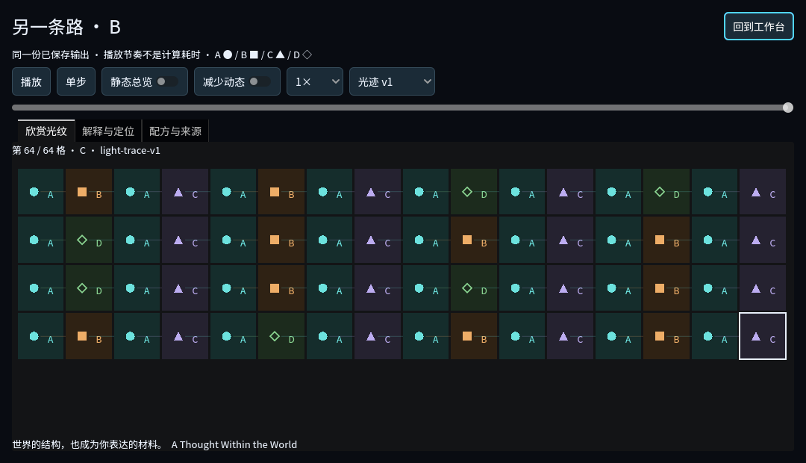
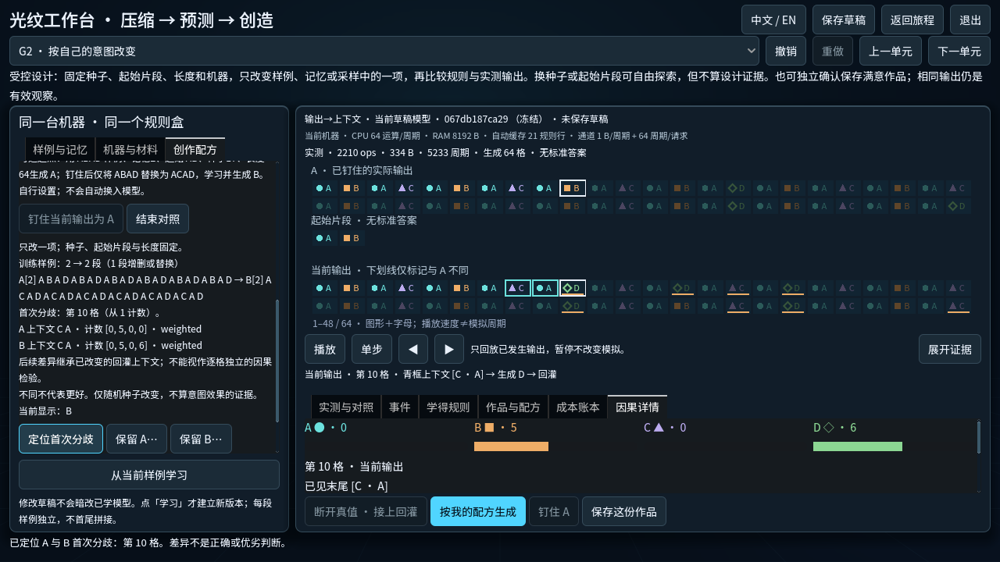

# 从材料到个人作品：2026-10-09 增量检查点

在实际开发线 `4483e30` 上深化已有三章，没有回退到简报的 `e46f866`。
开工远端核对：main 与原创造分支仍为e46f866，当前开发分支已包含后续修补。
没有重做模型、重写总引擎或改变原40任务。灯光是可逆候选呈现，非最终美术。

## 这一轮真正改变了什么

- **创作选择有可重开的证据。** 最新基线已经修掉“随机输出不同就算G2”的旧问题，
  当前G2是确认保留作品。本轮保留该成果语义，另存严格重放的
  `controlled-design-v1`：完整A/B配方、输出和首个分歧的真实上下文/计数。
  固定机器、种子、起始片段和长度，只改一个有效样例/记忆/采样因素。
  只换种子、改名、换配色或仅改变来源摘要而规则行相同，都不能冒充结构修改。
  输出相同也可保留有效观察，但不称为已观察到作品变化。
- **作品有了独立展演。** 已保存符号驱动16列光迹，支持播放、暂停、单步、定位、
  节奏、静态总览、减少动态；解释页沿用同一作品和游标，能返回真实生成事件、
  按该作品配方继续分叉。旧 `light-shapes-v1` 保留，新查看映射为 `light-trace-v1`。
  没有第二个创作模型、预制胜利动画、隐藏审美分数或新增音乐。
- **C/P有具体用途。** C3公开两份配送期限并允许选择RAW/预测包；实际无损总成本
  决定配送回执。P3增加同族练习/检查与公开的稀少例外样例，提交前不泄露真值，
  重复检查明确已见。材料不会自动替换玩家模型。

## 打开和连续审阅

现有启动器可从源码建立独立候选副本：

```sh
python3 scripts/run-experiment.py creation \
  --godot .godot/tools/godot-4.7.1/Godot.app/Contents/MacOS/Godot \
  --profile PersonalWorks-20261009 --journey
```

省略 `--journey` 直接进入光纹工作台。这些命令使用命名候选档，不接触原玩家档。
本机冻结构建/原生操作记录在本轮收尾后补在此页末尾。

建议Claude和同学先审阅一个片段：**G2钉住A→把第二样例ABAD换为ACAD→学习→生成B→
定位第10格→保留B→专注看作品→解释→返回配方继续改**。固定记忆2、起始AB、
种子17、长度64和同一台机器。自由创作无需照抄这个公开观察起点。

[中文完整会话与作品配方](captures-zh/session.json) ·
[A作品](captures-zh/work-A.json) · [B作品](captures-zh/work-B.json) ·
[实际运行报告](captures-zh/reports.json) · [独立进程重开/分叉](captures-zh/reopen-report.json)。



## 实测对照，不预写胜负

完整路径选择公开样例“稳定规律与稀少例外”、记忆2。C→P沿用同一模型
`5df927d35c1a…`，没有换入更强默认模型。G阶段先沿用模型接通回灌，再显式修改样例。

| 配送条件 | RAW | 预测包 | 公开期限 |
|---|---:|---:|---:|
| A：CPU 1运算/周期 | 235,928周期／436B | 294,932周期／401B | 240,000周期 |
| B：CPU 64运算/周期 | 225,601周期／436B | 216,375周期／401B | 223,000周期 |

两行原文/模型相同，只有CPU吞吐改变。包、元数据、模型装载、编解码与传输均按
原模型计费；学习是已经发生的准备成本，单列不重复收费。Deadline是公开任务要求，
不是给codec的奖励。其他玩家模型可能得到不同取舍。旧C3完成依据仍是历史条件对照；
新配送结果以实际回执为准，当前仅保留最近6份会话回执，不伪造新存档奖章。

[新预测家族校准](prediction-family.json)在相同B机器上重新学习、运行：

| 记忆 | 模型字节 | 独立练习 | 首次独立检查 | 检查周期 | 检查峰值内存 |
|---|---:|---:|---:|---:|---:|
| 1项 | 89B | 13/18 | 17/22 | 1,958 | 208B |
| 2项 | 155B | 17/18 | 21/22 | 2,479 | 340B |

两项历史帮助区分BA和CA，但训练中的BA后仍有C/D两种后继。新检查保留同族BA→D
例外，不用规则漂移冒充过拟合。再次运行检查的真实结果/成本相同，seen标记变为真；
练习内存低于200B/332B时拒绝新轮且保留上一轮。有限固定片段不是普遍泛化结论。

A/B只将第二段ABAD替换为ACAD，保持机器/采样实现/种子17/AB/64不变：
**12格不同，首次为第10格**。两边先前上下文均为CA，计数分别为
`[0,5,0,0]` 与 `[0,5,0,6]`。后续差异已经继承不同回灌，不能逐格宣称独立因果。
两件完整配方均重放一致；独立进程再次读取、选择旧映射、分叉并保存第三件作品，
原A/B的配方、符号、名称与身份保持原样。



## 验证层级与修正

- 固定官方Godot4.7.1，所有本地Godot/GUI串行，独立QA目录。
- 初轮8个相关套件中7个通过；订单17条断言无失败，但缺少verifier要求的PASS标记，
  因而整体诚实记为FAIL，后修正标记并通过。
- 整合13个相关套件中12个通过。工作台394项中6项指出P3新增说明把操作栏撑出窗口；
  将新说明/家族操作移至有界滚动面板后，完整工作台394项通过。未改测试放宽边界。
- 最后局部修补：未来配方禁用不可执行的展演分叉/证据按钮（47项通过）；
  同族上下文与设计来源保护22项通过。其余已通过的相邻套件不机械重复。
- 最终中/英文实际renderer分别80项通过：1280×720工作台、1080×620展演，
  使用公开样例的明确作者设置、真实viewport按钮及少量控制器桥接。
  两语言保存A/B完整快照/配方与截图。**这不是新人或原生OS输入证明。**
- 中文实际作品独立进程重开20项通过；比对原作品与文件字节，重放、旧映射静态查看
  不写入，随后新分叉保存且保留原作。新预测材料的校准使用实际Session逐格提交/揭晓。
- 本地品牌、试玩报告、SQLite存储Python检查通过；远端集成与构建结果另列。

[初轮原始结果](initial-focused/results.json) · [整合原始结果](integrated-focused/results.json) ·
[修复后的窗口检查](integrated-focused/workbench-layout-final.txt) ·
[最终设计/材料检查](integrated-focused/design-family-final.txt) ·
[中文renderer](captures-zh/run.txt) · [英文renderer](captures-en/run.txt)。

最终renderer源文件哈希：[rendered-source-sha256.json](rendered-source-sha256.json)。
早期导航回放脚本忘记模式切换会回到首单元，造成Family按钮不存在；失败日志保留于
`resolved-fixtures/`，不是运行时任务缺陷。另一批早期渲染受macOS启动全屏切换影响，
窗口2940×1846，且检查材料尚未修正，因此不作为最终最小窗口/同族检查证明。
最终QA副本仅另外将启动窗口模式设为0，发布源码正常设置未更改。

## 保存与未测边界

旧作品/完成来源原样保留；历史G2未带对照凭据时明示确认选择或旧生成来源。
扩展凭据及check-v2虽未改顶层版本，旧二进制可能拒绝读取扩展档；请使用本轮或
更新程序，不回写旧版本。未知比较版本保留已验证作品只读。没有碰真实玩家存档。

尚未证明：陌生玩家独立理解、最终灯光审美、Windows原生输入及跨设备体验。
静音完整可玩；本轮没有新增音频，故无新试听结论。配送回执与编辑中的钉住A/B是
会话状态，确认Keep后有效设计对照才持久保存；作品本身与完整配方不依赖会话状态。
